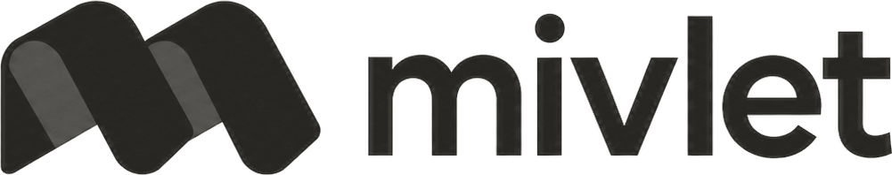

# Mivlet

<picture>
  <source media="(prefers-color-scheme: dark)" srcset="apps/desktop/public/brand/mivlet-lockup-dark.png">
  
</picture>

*One place for your AI agents.*

Mivlet is a provider-neutral, local-first workspace built around a quiet desktop
conversation with named agents. Connections, files, approvals, and an agent's
computer appear only when the work needs them.

Mivlet is local-first: conversations and workspace data are stored on the device,
provider credentials stay in native secure storage, and the default agent computer
runs locally. Connected providers and apps receive the context needed for their
requests. First-run setup uses a lightweight
Mivlet account, then validates a supported model provider and optionally connects
the apps a person already uses.

## Maturity

Mivlet is pre-release Windows desktop software. This repository contains a
substantial local product and an optional hosted-computer foundation; it is not
a deployed or production-validated service.

### Implemented locally

- A Tauri 2 desktop app with a compact React conversation shell, named agent
  profiles, persistent robot avatar identities or uploaded images, and model
  selection with supported reasoning levels. Dictation and send have separate
  controls below the message text.
- First-run setup with Google-first account sign-in, a verified model-provider
  connection, and optional app connectors. The default Chief of Staff appears
  only after setup is complete.
- One provider-driver registry with stable instance ids for ChatGPT/Codex,
  Claude, Google Antigravity, Grok, Cursor, OpenCode, and advanced direct API
  connections. Codex and Antigravity have provider-owned agent adapters;
  Cursor and Grok run through ACP; Claude uses its bidirectional Agent SDK
  protocol; and OpenCode runs behind a Mivlet-owned authenticated loopback
  server. All six provider-owned routes mediate consequential actions through
  Mivlet's one-time approval boundary. Direct OpenAI-compatible and Anthropic
  wire adapters are also runnable. Every route remains unavailable until its
  executable and account or credential are validated; catalogue presence is
  never presented as a live connection.
- Encrypted SQLite persistence for conversations, attached files, memory,
  connections, approvals, audit history, and a minimal internal execution
  attempt used for safe interruption and retry.
- Provider and plugin-style Connections, including connector and MCP
  boundaries. Credentials stay in native or service-secret custody rather than
  React state or conversation transcripts.
- Agent instructions travel as model context rather than appearing in user
  messages. Skills belong to their agent profile. ChatGPT turns use ephemeral
  Codex sessions while Mivlet keeps the durable conversation locally.
- Conversation turns preserve the order of updates and tool activity, with
  expandable public reasoning summaries, Markdown answers and reading-aware
  scrolling. Agents can create bounded passive DOCX files and XLSX workbooks
  with safe aggregate formulas in their private workspace. Generation,
  structural validation and immutable publication are separate steps;
  published Office documents and passive PDFs open as verified copies in their
  associated app.
- Workspace-wide app access and approval preferences shared by all agents,
  with exact approval checks for consequential tools and connector actions.
- Provider model visibility controls in Settings. Hidden models stay out of
  conversation pickers; hiding the selected model requires a new selection.
- File attachments and memory provide conversation context; Knowledge is no
  longer a separate product feature. Existing imported records remain stored.
- Native Windows application control through bundled Cua Driver 0.25.0, governed
  by the global approvals setting. Full Access needs
  no separate app grant; the agent finds and selects the window itself.
  A compact native activity window and Ctrl+Alt+Esc stop control. This shares
  your Windows session. Supported app controls use background delivery by default;
  screenshots, keys and pixel actions require an explicitly approved foreground
  selection. Minimized windows are unavailable. This is not a separate desktop.
  Structured observations, bounded input and scoped workspace files
  use Mivlet's native approval boundary. Screenshot delivery supports the
  vision-capable Codex app-server route and the audited OpenAI, Anthropic and xAI
  direct API models. See the [provider matrix](docs/architecture/local-teammate-computer.md#tool-and-provider-paths)
  for supported routes and [verification evidence](docs/development/local-computer-verification.md#visual-provider-expansion)
  for live limitations. No local shell tool is exposed.
- Runtime-detected operating-system dictation. It fails closed when speech
  recognition is unavailable and does not retain raw audio.

### Optional and deployment-gated

- The hosted runner contains bounded Cloudflare computer and browser endpoints
  with short-lived generation-fenced capabilities. Local tests and packaging
  checks do not prove that Containers, Browser Rendering, Durable Objects,
  Convex, Clerk, or production secrets have been deployed.
- Account sign-in gates first-run setup. Convex sync and remote workspace code
  remain optional foundation for future shared or multi-device work and are not
  current production collaboration claims.
- Account sign-in needs configured Clerk OIDC. Confidential connector OAuth
  needs the separate broker and provider
  configuration. Direct provider APIs and Codex browser sign-in still require
  valid credentials, entitlement, installed components, and network access.
  Antigravity's managed installer is currently Windows x64 only. Claude,
  Cursor, Grok, and OpenCode require their official command-line runtime to be
  installed separately before Mivlet can connect it.

### Not complete

- Automatic continuation of ordinary conversations after the desktop app
  closes.
- Secure sign-in or secret handoff inside a hosted agent computer.
- Deployed hosted operation, live third-party validation, production tenancy,
  metering, quotas, monitoring, disaster recovery, or multi-device sync.
- Signed public installers, updater channels, supported macOS/Linux releases,
  and mobile control.

The [local computer](docs/architecture/local-teammate-computer.md) and
[hosted computer](docs/architecture/hosted-teammate-computer.md) documents define
their separate trust boundaries.

## Repository layout

```text
apps/desktop        React UI, Convex functions, and the Tauri Rust boundary
apps/hosted-runner  deployment-gated Cloudflare computer/browser worker
apps/broker         narrow confidential connector OAuth broker
packages/protocol   shared product and authority contracts
packages/connectors provider, connector, tool, voice, and MCP adapters
packages/knowledge  local ingestion and retrieval engine
docs                maintained architecture, security, and operations notes
```

## Requirements

- Node.js 22 or newer
- pnpm 10 (the repository pins `pnpm@10.15.0`)
- Stable Rust and the Windows Tauri prerequisites
- Windows WebView2
- Official Codex app-server components for optional ChatGPT browser sign-in

Native computer use supports Windows x64. The normal development/build commands
download and verify the pinned driver, then bundle it with Mivlet and its license
notices. Installed users need no Docker, Python, Node, uv or separate Cua app for
this capability. Windows WebView2 and a validated model provider are still
required; provider-specific runtime prerequisites above remain separate.

## Development

```bash
pnpm install --frozen-lockfile
pnpm dev
```

`pnpm dev` starts the browser-only Vite preview, whose synthetic state is
labelled. Use the native app for provider credentials, encrypted persistence,
and native Windows application control:

```bash
pnpm tauri:dev
```

Configuration templates live beside the component that owns them:

- `apps/desktop/.env.example`
- `apps/broker/.env.example`
- `apps/broker/.dev.vars.example`
- `apps/hosted-runner/.dev.vars.example`

Keep real credentials out of Git. Missing optional configuration must leave the
related capability unavailable rather than substituting a fixture.

## Verification

The broad repository gates are:

```bash
pnpm typecheck
pnpm test
pnpm quality
pnpm verify:build
pnpm perf:check
pnpm perf:test
pnpm release:test
pnpm tauri:check
```

For Rust changes, also run:

```bash
cargo fmt --manifest-path apps/desktop/src-tauri/Cargo.toml -- --check
cargo clippy --manifest-path apps/desktop/src-tauri/Cargo.toml --all-targets --all-features -- -D warnings
cargo test --manifest-path apps/desktop/src-tauri/Cargo.toml
```

Hosted-runner changes require its focused tests, build, and a Wrangler dry-run.
A dry-run validates packaging and bindings only; it does not validate a live
Cloudflare environment.

## Working principles

- Keep the default UI sparse, conversational, accessible, and agent-first.
- Preserve provider choice behind Mivlet-owned contracts and adapters.
- Keep credentials behind native or deployment-secret boundaries.
- Bind consequential actions to exact approvals and fail closed when authority
  or configuration is missing.
- Treat fixtures, tests, dry-runs, and local builds as local evidence, never as
  deployment, integration, or product-parity evidence.

Contributor guidance is in [AGENTS.md](AGENTS.md). Product direction is in
[docs/product/vision.md](docs/product/vision.md).

## Compatibility

Mivlet keeps the existing `@fable/*` package names, `FABLE_*` configuration keys,
native application identifier, database and credential namespaces, and computer
paths. These are compatibility identifiers, not product branding; changing them
without a migration could disconnect existing installations from their data.
See the [Windows release guide](docs/operations/windows-private-release.md) for
installer upgrade behavior and verification limits.
