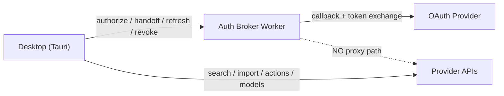
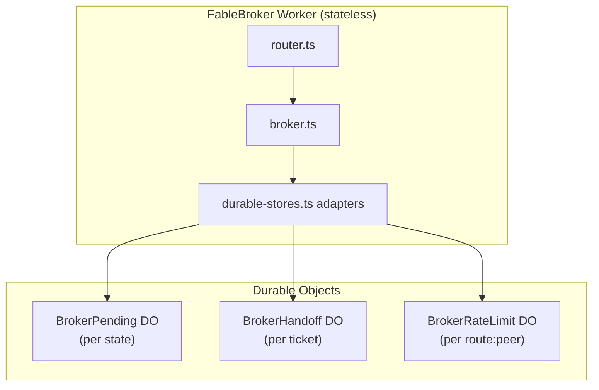
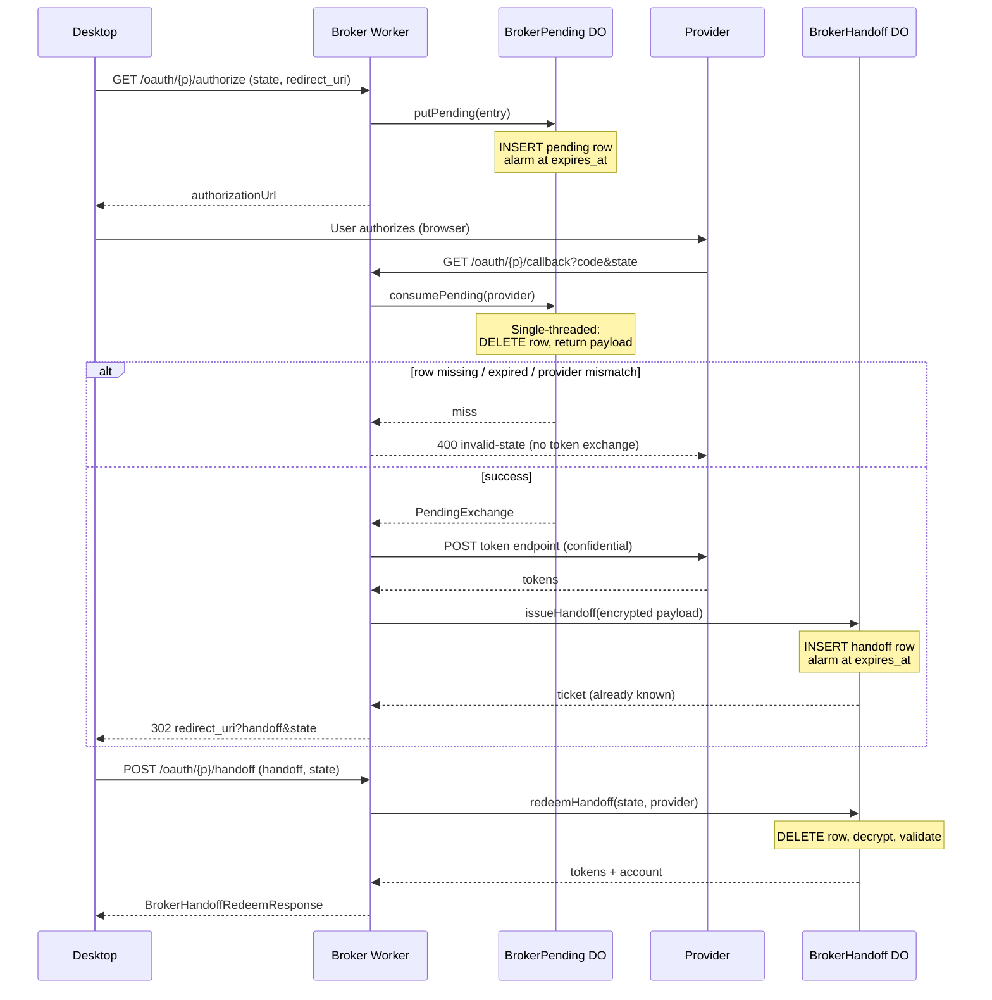
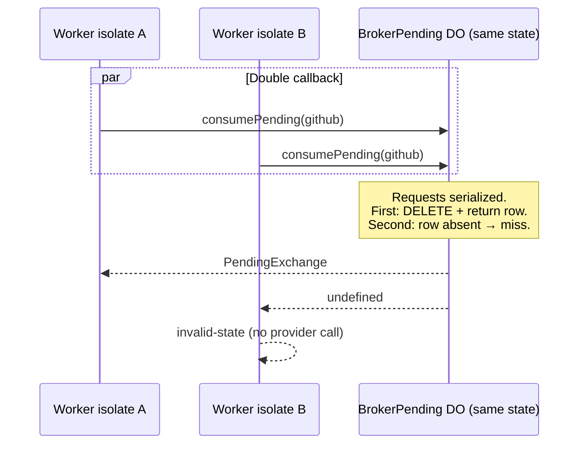

# ADR: Replace auth broker in-process ephemeral stores with Durable Objects

| Field | Value |
| :--- | :--- |
| **Status** | Proposed (design / evidence only) |
| **Date** | 2026-07-03 |
| **Branch** | `grok/overnight-broker-storage-adr` |
| **Scope** | `apps/broker` pending OAuth, handoff, and rate-limit stores on Cloudflare Workers |
| **Out of scope** | Broker runtime code changes, deploy, Cloudflare resource creation, credentials, push, merge |

## Summary

Replace the auth broker’s three in-process `Map` stores with **SQLite-backed Durable Objects (DOs)**, one DO instance per high-entropy key, preserving the broker as a **narrow confidential-OAuth broker** (never a connector proxy or model service).

Pending exchanges, handoff tickets, and rate-limit windows each map to a dedicated DO namespace. Consume-once semantics rely on DO single-threaded execution plus explicit row deletion before returning payload. Handoff token sets and PKCE verifiers are **AES-256-GCM encrypted at rest** with HKDF-derived keys and binding AAD. Node/local dev keeps the existing in-memory stores behind a storage backend switch.

**Linked acceptance test plan:** [broker-ephemeral-storage-test-plan.md](./broker-ephemeral-storage-test-plan.md)

---

## Context

### What is implemented today (code in repo)

The portable broker core in `apps/broker` implements the version-1 confidential OAuth lifecycle:

| Component | File | Behavior today |
| :--- | :--- | :--- |
| Pending exchange store | `src/stores.ts` | `Map<state, PendingExchange>`; `consume(state)` deletes then returns; inline TTL check (`BROKER_HANDOFF_TTL_SECONDS` = 60) |
| Handoff store | `src/stores.ts` | `Map<ticket, HandoffEntry>`; `redeem(ticket, state)` deletes then validates TTL + state binding |
| Rate limiter | `src/rate-limiter.ts` | Fixed-window per `route:peer`; in-process; fail-closed at 4096 keys |
| Broker service | `src/broker.ts` | Injects stores via `BrokerOptions.pending` / `.handoff`; defaults to `createStores(clock)` |
| Worker transport | `src/worker.ts` | Lazy per-isolate `FableBroker`; **no durable bindings** |
| Contract + TTL | `packages/connectors/src/providers/broker-contract.ts` | `BROKER_HANDOFF_TTL_SECONDS = 60` |
| Security tests | `src/broker.test.ts`, `src/router.test.ts` | Single-use state/handoff, provider binding, TTL, redaction |

`docs/connectors/auth-broker.md` documents the limitation explicitly: stores are process-local and unsuitable for multi-isolate production Workers.

### Problem

Cloudflare Workers scale horizontally across isolates and PoPs. Two requests in the same OAuth flow (authorize → provider callback → desktop handoff redeem) may land on **different isolates**. In-memory maps are not shared; a callback can miss a pending exchange created on another isolate, or a double callback can race without cross-isolate single-use guarantees.

### Constraints (must hold after migration)

1. **Atomic consume-once** under concurrent duplicate callbacks / redeems.
2. **Strict TTL** (≤60s) with deterministic expiry rejection and background cleanup.
3. **Replay resistance** — reused `state` or `handoff` fails closed before token exchange or token release.
4. **Provider / state / redirect binding** — callback provider must match pending; handoff redeem state must match; redirect URI taken only from consumed pending row.
5. **Token confidentiality at rest and in observability** — no plaintext tokens/verifiers in DO SQLite, logs, or Worker Analytics; existing `redactForLog` preserved.
6. **Regional consistency** — consume sees a write from authorize regardless of edge isolate (within documented DO consistency).
7. **Bounded abuse / rate limiting** — cross-isolate per `route:peer` budget; fail-closed under map pressure.
8. **Local deterministic tests** — Node/vitest without live Cloudflare credentials.
9. **Migration / rollback** — feature-flagged backend; revert without schema loss to desktop contract.
10. **Broker boundary** — still only authorize, callback, handoff, refresh, revoke; no connector/model routes.

---

## Options evaluated

Evaluation uses current Cloudflare official guarantees (docs dated 2026-04–06 where noted).

### Option A — Workers KV

| Requirement | KV official behavior | Verdict |
| :--- | :--- | :--- |
| Atomic consume-once | Eventually consistent; concurrent writes to same key: **last write wins**; no read-delete transaction ([How KV works](https://developers.cloudflare.com/kv/concepts/how-kv-works/), [Write key-value pairs](https://developers.cloudflare.com/kv/api/write-key-value-pairs/)) | **Fails** |
| Strict TTL | `expirationTtl` minimum **60 seconds**; deletion asynchronous | Marginal (matches 60s floor, not stricter) |
| Replay resistance | Cannot atomically “read and delete if exists” | **Fails** |
| Regional consistency | Cross-PoP visibility up to **60s+** after write | **Fails** for callback immediately after authorize at different edge |
| Rate limiting | 1 write/key/sec; 429 under concurrent updates | **Poor** for per-peer windows |

Cloudflare explicitly directs workloads needing stronger consistency to Durable Objects.

**Rejected.**

### Option B — D1 (SQLite) with transactions

| Requirement | D1 official behavior | Verdict |
| :--- | :--- | :--- |
| Atomic consume-once | `batch()` runs statements as **sequential SQLite transactions** per call ([D1 Database API](https://developers.cloudflare.com/d1/worker-api/d1-database/)). Cross-Worker races on same row rely on SQLite primary row locking — workable with `DELETE … RETURNING` guarded by `expires_at` and `provider` | **Possible** with careful SQL |
| Strict TTL | App-managed `expires_at`; no built-in row TTL; prune via scheduled job or inline delete | **App responsibility** |
| Regional consistency | Primary holds writes; read replicas are **async** ([Read replication](https://developers.cloudflare.com/d1/best-practices/read-replication/)). Consume **must** use `withSession("first-primary")` or bookmarked session or risk stale miss/hit | **Fragile** unless all ephemeral ops hit primary |
| Rate limiting | `UPDATE … SET count = count + 1` races need transaction; hot peer keys contend on single primary | **Workable** but higher latency than edge-local DO |
| Local tests | `wrangler dev` / miniflare D1 simulation | Good |
| Ops | Migrations, backups, `rows_read`/`rows_written` billing | Extra moving parts for **sub-60s** ephemeral rows |

D1 is viable for a skilled implementation but adds session/bookmark discipline and primary-region latency for every OAuth hop. Ephemeral single-row lifetimes fit DO’s per-key instance model better than a shared global database.

**Rejected as primary store; acceptable as future analytics export only.**

### Option C — Durable Objects (SQLite storage) — **Selected**

| Requirement | DO official behavior | Verdict |
| :--- | :--- | :--- |
| Atomic consume-once | **Single-threaded** per object instance; requests serialized ([Rules of Durable Objects](https://developers.cloudflare.com/durable-objects/best-practices/rules-of-durable-objects/)) | **Strong fit** |
| Strict TTL | App `expires_at` + `alarm()` for sweeps; inline check on access | **Strong fit** |
| Replay resistance | Delete-before-return in serialized handler | **Strong fit** |
| Regional consistency | Each object has one authoritative instance; `get(id)` routes to that instance ([Data location](https://developers.cloudflare.com/durable-objects/reference/data-location/)) | **Strong fit** for per-flow keys |
| Rate limiting | Shard per `route:peer` DO; ~500–1000 req/s per object | **Strong fit** at broker scale |
| Token at rest | DO SQLite encrypted at platform layer; **add app-layer AES-GCM** for tokens/verifiers | **Required** |
| Local tests | `@cloudflare/vitest-pool-workers` + in-memory store adapter sharing interfaces | **Strong fit** |
| Cost | Per-request DO billing + storage; low cardinality (one DO per active OAuth flow) | **Acceptable** |

**Selected.**

---

## Decision

Adopt **three DO namespaces** with **per-key sharding** (one DO instance per `state`, per `handoff` ticket, per `route:peer` rate-limit key):

```
BROKER_PENDING   — idFromName(SHA-256(state))
BROKER_HANDOFF   — idFromName(SHA-256(handoff))
BROKER_RATELIMIT — idFromName(route + ":" + peerKey)
```

`peerKey` = first 16 bytes of `SHA-256(peer)` hex (peer is `CF-Connecting-IP`; never logged).

The Worker remains a stateless router; `FableBroker` depends on injected `PendingExchangeStore`, `HandoffStore`, and `RateLimiter` interfaces (unchanged surface). Production Worker passes DO-backed adapters; Node dev keeps `createStores` / `createRateLimiter`.

### Broker boundary (unchanged)



---

## Architecture

### Component diagram



### Sequence — authorize → callback → redeem



### Sequence — concurrent callback race (replay)



---

## Data model

### DO class: `BrokerPending`

**Routing:** `env.BROKER_PENDING.get(env.BROKER_PENDING.idFromName(stateHash))` where `stateHash = base64url(SHA-256(state))`.

**SQLite schema (per instance, at most one row):**

```sql
CREATE TABLE IF NOT EXISTS pending (
  state_hash     TEXT PRIMARY KEY,
  provider       TEXT NOT NULL,
  redirect_uri   TEXT NOT NULL,
  provider_redirect_uri TEXT NOT NULL,
  state          TEXT NOT NULL,
  verifier_enc   BLOB,              -- NULL if desktop-pkce provider
  created_at_ms  INTEGER NOT NULL,
  expires_at_ms  INTEGER NOT NULL
);
```

### DO class: `BrokerHandoff`

**Routing:** `idFromName(handoffHash)` where `handoffHash = base64url(SHA-256(handoff))`.

```sql
CREATE TABLE IF NOT EXISTS handoff (
  ticket_hash    TEXT PRIMARY KEY,
  provider       TEXT NOT NULL,
  state          TEXT NOT NULL,
  payload_enc    BLOB NOT NULL,     -- AES-GCM ciphertext of HandoffPayload JSON
  created_at_ms  INTEGER NOT NULL,
  expires_at_ms  INTEGER NOT NULL
);
```

`HandoffPayload` (plaintext before encryption):

```typescript
interface HandoffPayload {
  tokens: ConnectorTokenSet;
  account: ConnectorAccountSummary;
}
```

### DO class: `BrokerRateLimit`

**Routing:** `idFromName(base64url(SHA-256(route + "\0" + peerKey)))`.

```sql
CREATE TABLE IF NOT EXISTS window (
  id             INTEGER PRIMARY KEY CHECK (id = 1),
  window_start_ms INTEGER NOT NULL,
  count          INTEGER NOT NULL
);
```

Single-row table per DO instance (fixed-window counter).

---

## Transaction steps and exact race behavior

### `putPending` (authorize)

1. Validate `state` length (≥16 chars, ≤512) — reject oversized keys before DO routing.
2. `INSERT OR REPLACE INTO pending (…) VALUES (…)`.
3. `setAlarm(expires_at_ms)` (coalesce if earlier alarm exists).
4. Return `void`.

**Races:** Two authorize calls with the same `state` overwrite the row (desktop contract treats `state` as single-use and desktop-generated unique). Second authorize resets TTL — acceptable; provider still receives one active state.

### `consumePending(provider)` (callback)

Executed inside DO mutex (single-threaded):

1. `now = Date.now()`.
2. `SELECT … FROM pending WHERE state_hash = ?`.
3. If no row → return `undefined` (maps to `invalid-state`).
4. If `now > expires_at_ms` → `DELETE` → return `undefined`.
5. If `row.provider !== provider` → `DELETE` → return `undefined` (fail-closed; prevents cross-provider replay on same state).
6. `DELETE FROM pending WHERE state_hash = ?`.
7. Decrypt `verifier_enc` if present; return `PendingExchange`.

**Races:** See sequence diagram. Only one concurrent consumer succeeds; losers observe empty table **without** calling provider token endpoint (Worker checks `undefined` before `exchangeCode` — existing `broker.ts` order preserved).

### `issueHandoff` (callback, after token exchange)

Ticket generated in Worker (`urlSafeToken(32)`) **before** DO call; handoff DO only stores.

1. Serialize `HandoffPayload` → JSON → encrypt → `payload_enc`.
2. `INSERT INTO handoff (…) VALUES (…)`.
3. `setAlarm(expires_at_ms)`.

### `redeemHandoff(state, provider)` (desktop POST)

1. `SELECT … FROM handoff`.
2. If no row → `undefined`.
3. **`DELETE` row immediately** (consume-once before validation, matching current `stores.ts` semantics).
4. If expired → `undefined`.
5. If `state` or `provider` mismatch → `undefined` (row already deleted — replay impossible).
6. Decrypt `payload_enc`; return entry.

**Races:** Second redeem always misses (row deleted on first attempt even if state wrong).

### `checkRateLimit(limit, windowMs)` (router)

1. Load `window` row id=1.
2. If absent or `now - window_start_ms >= windowMs` → reset `{start: now, count: 1}`.
3. Else increment `count`; if `count > limit` → `{allowed: false, …}`.
4. Persist; return result.

**Races:** Serialized per `route:peer` DO — cross-isolate rate limit is accurate. Hot peers isolated; no global 4096-key cap needed (each peer DO holds one row). Abuse of unique peer rotation creates DO instances — bounded by Cloudflare account limits; monitor DO creation rate.

---

## Serialization and encryption

| Field | Format | Encrypted |
| :--- | :--- | :--- |
| Pending metadata (redirect URIs, provider, state) | Plaintext SQL text | No (non-secret; redirect URIs already in authorize request) |
| PKCE verifier | Binary blob | **Yes** |
| Handoff tokens + account | JSON → bytes | **Yes** |

**Algorithm:** AES-256-GCM via Web Crypto (`globalThis.crypto.subtle`).

**Master secret:** Worker secret `FABLE_BROKER_STORE_ENCRYPTION_KEY` (32 bytes base64url, CSPRNG). Distinct from provider client secrets. **Not** committed; documented in `.dev.vars.example`.

**Per-record key derivation (HKDF-SHA256):**

```
IKM   = decodeBase64Url(FABLE_BROKER_STORE_ENCRYPTION_KEY)
salt  = UTF-8(entryId)          -- stateHash or handoffHash
info  = UTF-8("fable-broker-store:v1:" + kind)   -- kind ∈ pending-verifier | handoff-payload
key   = HKDF-SHA256(ikm, salt, info, 32)
```

**Per-record nonce:** 12-byte random (`randomBytes(12)`), prepended to ciphertext: `nonce || ciphertext || tag`.

**AAD (additional authenticated data):**

```
pending-verifier:  "pending:" + provider + ":" + stateHash
handoff-payload:   "handoff:" + provider + ":" + state + ":" + ticketHash
```

Swap of ciphertext between rows or providers fails GCM decryption → treated as miss (`invalid-handoff` / `invalid-state`).

**Observability:** Structured logs include only: `correlationId`, `route`, `provider`, `storeOp` (`pending.put` | `pending.consume` | `handoff.issue` | `handoff.redeem` | `ratelimit.check`), `result` (`hit` | `miss` | `expired` | `mismatch`), `latencyMs`. Never `state`, `handoff`, `peer`, tokens, verifiers, or ciphertext.

---

## TTL and cleanup

| Store | TTL source | Enforcement |
| :--- | :--- | :--- |
| Pending | `created_at + BROKER_HANDOFF_TTL_SECONDS` | Inline on consume; `alarm()` deletes row if still present |
| Handoff | same | Inline on redeem; `alarm()` backup delete |
| Rate limit | `windowMs` (60_000 default) | Window reset on access; no long-lived garbage |

`alarm()` handler:

```typescript
async alarm() {
  this.ctx.storage.sql.exec("DELETE FROM pending WHERE expires_at_ms <= ?", Date.now());
  // or handoff equivalent
}
```

KV’s 60-second minimum TTL floor does not apply to DO. Broker keeps **60s** per `BROKER_HANDOFF_TTL_SECONDS` unless contract version bumps.

---

## Regional consistency and placement

- **DO consistency:** All operations for a given `state` / `handoff` / `route:peer` hit the **same global object instance**; mutations are serialized. Authorize (desktop region) and callback (provider/browser region) converge on the object’s home location — cross-edge consistency is stronger than KV and simpler than D1 session bookmarks.
- **Location hint (optional):** `FABLE_BROKER_STORE_LOCATION_HINT` (e.g. `enam`) passed to **first** `get()` for pending DO only. Hints are best-effort ([Data location](https://developers.cloudflare.com/durable-objects/reference/data-location/)). Default: Cloudflare-chosen near first `putPending`.
- **Jurisdiction:** Use `env.BROKER_PENDING.jurisdiction("us")` (or `eu`) if deployment policy requires it; IDs differ per jurisdiction — document in operator runbook.

---

## Bindings and deployment model (proposed)

### Wrangler additions (not applied in this ADR branch)

```jsonc
{
  "durable_objects": {
    "bindings": [
      { "name": "BROKER_PENDING", "class_name": "BrokerPending" },
      { "name": "BROKER_HANDOFF", "class_name": "BrokerHandoff" },
      { "name": "BROKER_RATELIMIT", "class_name": "BrokerRateLimit" }
    ]
  },
  "migrations": [
    { "tag": "v1-broker-ephemeral", "new_sqlite_classes": [
        "BrokerPending", "BrokerHandoff", "BrokerRateLimit"
      ]
    }
  ]
}
```

### Secrets / vars

| Name | Required | Purpose |
| :--- | :--- | :--- |
| `FABLE_BROKER_STORE_ENCRYPTION_KEY` | Yes (durable mode) | 32-byte base64url HKDF root |
| `FABLE_BROKER_STORAGE_BACKEND` | No | `memory` (default) \| `durable` |
| `FABLE_BROKER_STORE_LOCATION_HINT` | No | DO placement hint |

### Runtime wiring (proposed)

```typescript
// worker.ts (pseudocode — not implemented in this ADR)
const backend = env.FABLE_BROKER_STORAGE_BACKEND ?? "memory";
const stores = backend === "durable"
  ? createDurableStores(env, clock)
  : createStores(clock);
```

Node `server.ts` ignores durable backend; always memory.

---

## Cost and operational failure modes

### Cost drivers (order-of-magnitude)

| Traffic pattern | DO invocations | Notes |
| :--- | :--- | :--- |
| 1 OAuth connect | ~4–6 DO requests | pending put, pending consume, handoff put, handoff redeem, 1–2 rate limits |
| Steady refresh/revoke | 0 ephemeral DO | Refresh/revoke bypass pending/handoff stores |
| Abuse scan | 1 rate-limit DO per peer/route | Fails closed; caps provider hammering |

Billing follows Cloudflare DO request + duration + storage meters. Ephemeral rows are tiny (<2 KB) and deleted within 60s — storage churn is low.

### Failure modes

| Failure | Symptom | Mitigation |
| :--- | :--- | :--- |
| DO unreachable / overloaded | 503 `provider-unavailable` (retryable) | Worker catches stub errors; desktop retries handoff; user restarts OAuth if pending lost |
| `consume` miss after authorize | `invalid-state` at callback | User restarts OAuth (same as today after isolate loss) |
| Encryption key missing | 503 `configuration-required` at Worker boot | Fail closed in `runtimeFor` |
| Encryption key rotation | Old rows decrypt fail → miss | Dual-key window: accept `KEY` and `KEY_PREVIOUS` during rotation (proposed) |
| Alarm delay | Row lingers past TTL | Inline expiry still rejects redeem/consume |
| Rate-limit DO hot peer | Latency on limit check | Acceptable; shard further if needed |
| Wrong `STORAGE_BACKEND=durable` without migrations | Deploy failure | Wrangler migration gate |

---

## Migration and rollback

### Rollout

1. Ship DO classes + adapters behind `FABLE_BROKER_STORAGE_BACKEND=memory` (default).
2. Apply DO migration in staging; set `durable` + encryption secret.
3. Run acceptance tests ([test plan](./broker-ephemeral-storage-test-plan.md)) including concurrent callback harness.
4. Enable production `durable`; monitor DO error rate and p99 OAuth latency.

### Rollback

1. Set `FABLE_BROKER_STORAGE_BACKEND=memory` (instant revert to per-isolate semantics).
2. DO data becomes unreachable but expires in ≤60s anyway — no long-lived user impact.
3. Desktop contract unchanged — no app release required.

### Encryption key rotation

1. `wrangler secret put FABLE_BROKER_STORE_ENCRYPTION_KEY_PREVIOUS` ← old key
2. Deploy new `FABLE_BROKER_STORE_ENCRYPTION_KEY`
3. After 120s (2× TTL), remove `KEY_PREVIOUS`

---

## Local deterministic testing strategy

| Layer | Mechanism |
| :--- | :--- |
| Unit (no CF) | Existing `createStores` + inject into `FableBroker` — **unchanged** |
| Adapter contract | New `InMemoryDurableStub` simulating DO SQL + alarm semantics in process |
| Integration | `@cloudflare/vitest-pool-workers` with miniflare DO SQLite |
| Concurrency | `Promise.all` double callback/redeem against same stub — exactly one success |

Node transport never loads DO bindings; CI without Cloudflare credentials runs unit + adapter tests only. DO integration tests run in broker package when `CF` test account available (optional job).

---

## Work classification

| Item | Status |
| :--- | :--- |
| In-memory stores, broker lifecycle, router, tests | **Implemented** |
| DO classes, durable adapters, wrangler bindings, encryption helpers, feature flag | **Proposed** (this ADR) |
| Staging/prod deploy, provider console callbacks, security review | **External validation** (per `docs/connectors/auth-broker.md`, `docs/security/threat-model.md`) |

---

## References

- [Auth broker contract](../connectors/auth-broker.md)
- [Threat model](../security/threat-model.md)
- [Cloudflare KV — How KV works](https://developers.cloudflare.com/kv/concepts/how-kv-works/)
- [Cloudflare KV — Write key-value pairs](https://developers.cloudflare.com/kv/api/write-key-value-pairs/)
- [Cloudflare D1 — Database API / batch transactions](https://developers.cloudflare.com/d1/worker-api/d1-database/)
- [Cloudflare D1 — Read replication & Sessions API](https://developers.cloudflare.com/d1/best-practices/read-replication/)
- [Cloudflare Durable Objects — Rules](https://developers.cloudflare.com/durable-objects/best-practices/rules-of-durable-objects/)
- [Cloudflare Durable Objects — Data location](https://developers.cloudflare.com/durable-objects/reference/data-location/)
- Repo: `apps/broker/src/stores.ts`, `apps/broker/src/broker.ts`, `apps/broker/src/rate-limiter.ts`