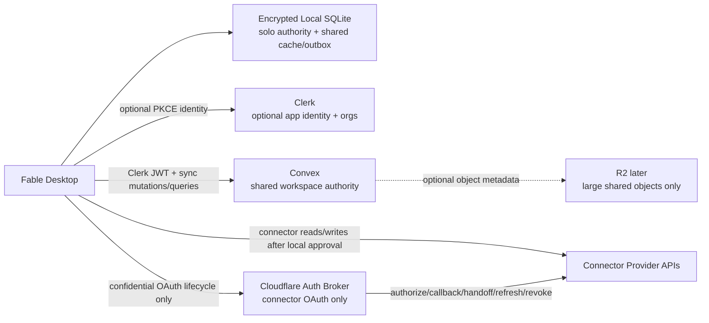

# ADR: Optional Cloud Team Backend

Date: 2026-07-05

Status: Accepted for Batch 7 implementation planning

Branch: `codex/cloud-backend-adr`

## Decision

Use **Clerk + Convex** for Fable's first optional cloud/team workspace MVP.

Cloudflare continues to host the separate confidential OAuth broker, waitlist,
and edge services. Cloudflare R2 is acceptable later for large, explicitly
shared binary objects, but it is not the authoritative team database for the
MVP. Do not duplicate authoritative team or product records across Convex and
D1.

Fable remains local-first:

- Solo workspaces keep encrypted local SQLite as the only authority.
- Clerk, Convex, Cloudflare, Postgres, and provider credentials are never
  required for local solo startup.
- A workspace becomes cloud-backed only after an explicit user action to create
  or join a shared workspace.
- Connector OAuth remains separate from Clerk identity and from team sync.

## Context

The current repository already has:

- encrypted local SQLite with workspace isolation, tombstones, export/import,
  and credential-free archives;
- OS keyring custody for vault keys, model keys, connector tokens, and the
  config-gated Clerk identity spike;
- a narrow Cloudflare Worker auth broker for confidential connector OAuth;
- Google direct desktop public-client PKCE, independent from the broker;
- optional Convex client initialization behind `VITE_CONVEX_URL`, but no schema
  or collaboration implementation.

The selected backend must add team collaboration without weakening the existing
offline solo guarantees or turning cloud identity into a prerequisite for local
use.

Official references reviewed:

- [Convex + Clerk auth](https://docs.convex.dev/auth/clerk)
- [Convex realtime subscriptions](https://docs.convex.dev/realtime)
- [Convex file storage security model](https://docs.convex.dev/file-storage/overview)
- [Convex database transactions in mutations](https://docs.convex.dev/database/writing-data)
- [Clerk + Convex integration guide](https://clerk.com/docs/guides/development/integrations/databases/convex)
- [Cloudflare Durable Objects](https://developers.cloudflare.com/durable-objects/)
- [Cloudflare D1 storage guidance](https://developers.cloudflare.com/workers/platform/storage-options/)
- [Cloudflare R2](https://developers.cloudflare.com/r2/)
- [PowerSync local-first note](https://docs.powersync.com/resources/local-first-software)
- [Electric Sync](https://electric.ax/docs/sync/)

## Selected Architecture

Convex is the authoritative store for shared workspace records. The local
desktop keeps an encrypted SQLite mirror for offline reads and a durable outbox
for offline or retryable shared mutations. Convex mutations validate Clerk
identity, organization membership, Fable workspace role, device status, record
ownership, idempotency keys, and revision preconditions before accepting writes.

## Record Boundaries

### Never leaves the device

These records and payloads must not be sent to Convex, Clerk, Cloudflare, R2,
Postgres, analytics, logs, or connector providers unless a later ADR explicitly
changes a narrower subcase:

- SQLite vault master key.
- OS keyring credentials.
- Connector OAuth access tokens, refresh tokens, auth codes, PKCE state, PKCE
  verifiers, handoff tickets, broker store keys, and credential references.
- BYOK model API keys.
- Local Ollama prompts and responses.
- Raw connector responses, raw email/message/file bodies, and private connector
  cache internals not explicitly selected for sharing.
- Execution permits, approval request fingerprints, lease tokens, scheduler
  queue authority, and private audit payloads.
- Environment variables, absolute local paths, shell output, local filesystem
  metadata beyond user-selected names, and crash/debug dumps.
- Unselected private knowledge sources, memory records, drafts, run logs,
  messages, artifacts, and workflow prompts.
- Browser/session automation state and mobile-remote pairing secrets.

### Eligible for explicit sharing

Only records marked by the user as part of a cloud-backed shared workspace are
eligible for sync:

- Shared workspace metadata: title, created/updated timestamps, owner org,
  retention/export policy, and feature flags.
- Project metadata and membership-visible navigation.
- Thread and message records intentionally created in a shared workspace.
- Shared knowledge source metadata, chunks, and previews that were explicitly
  added to the shared workspace.
- Shared memory records explicitly approved for the shared workspace.
- Shared workflow definitions and schedules when the schedule is authored for a
  team workspace.
- Redacted action summaries that the workspace policy says are visible to the
  team.
- Tombstones for shared deletions and forgets.
- Large object metadata for user-selected shared files; bytes may later live in
  Convex storage or R2 behind the same authorization rules.

## Authority Model

| Workspace mode | Authority | Offline read | Offline write |
| :--- | :--- | :--- | :--- |
| Solo local | Encrypted local SQLite | Full | Full, committed locally |
| Shared online | Convex | Local mirror plus realtime stream | Sent to Convex; local pending state until accepted |
| Shared offline | Last accepted Convex mirror in encrypted SQLite | Full for cached records | Queued in local outbox; not globally committed until Convex accepts |

The desktop must make the pending/accepted distinction visible enough to avoid
implying that an offline shared mutation has already reached teammates.

## Membership And Roles

Clerk owns authentication and organization identity. Convex owns Fable's
workspace membership projection and authorization decisions.

Required MVP roles:

- `owner`: manage workspace, members, export, erasure, and destructive policy.
- `admin`: manage members except owner transfer, manage shared settings.
- `editor`: create/update shared projects, messages, knowledge, workflows, and
  schedules subject to approval policy.
- `viewer`: read shared records and export permitted records, no writes.

Every Convex query and mutation must derive the user from `ctx.auth`, require a
matching Clerk user, require the expected Clerk organization when the workspace
is org-backed, and check the Fable `workspace_memberships` table. Clerk org
membership is necessary but not sufficient; Fable role and workspace status are
also required.

## Device Identity

Each install generates a random `device_id` and signing keypair inside the
native keyring boundary. The public device record is linked to the Clerk user
and shared workspace in Convex.

Device identity is used for:

- outbox mutation provenance;
- idempotency namespace;
- cursor ownership;
- audit attribution;
- selective device unlink/revocation.

Device identity is not a substitute for Clerk authentication. A valid Clerk
session and valid workspace membership are still required for every cloud read
or write. If a device is unlinked, queued writes from that device are rejected on
reconnect and the local shared cache is marked stale until the user re-links or
removes it.

## Outbox, Cursor, And Idempotency

The MVP sync contract uses these local tables or equivalent Rust repository
surfaces:

- `cloud_workspace_link`: local workspace id, Convex workspace id, Clerk org id,
  selected role, last accepted revision, linked device id, and sync state.
- `cloud_sync_cursor`: per linked workspace/device cursor, last pulled revision,
  last realtime sequence, and last successful sync timestamp.
- `cloud_mutation_outbox`: stable local mutation id, idempotency key,
  workspace id, device id, base revision, record type, record id, operation,
  encrypted payload, created time, attempt count, and status.
- `cloud_record_shadow`: local mapping of shared record id to last accepted
  server revision, content fingerprint, deletion state, and conflict metadata.

Every cloud mutation carries:

- `workspaceId`;
- `deviceId`;
- `clientMutationId`;
- `idempotencyKey = workspaceId:deviceId:clientMutationId`;
- `baseRevision`;
- `recordType`;
- `recordId`;
- `operation`;
- redacted/allowed payload only.

Convex stores consumed idempotency keys with result metadata. Replays return the
same accepted/rejected result instead of applying the write again. Convex
mutations run transactionally and advance a monotonic workspace revision when a
write is accepted. Clients pull records and tombstones after their last accepted
revision and subscribe to current shared views for realtime updates.

## Conflict Policy

The MVP intentionally avoids general CRDT semantics. Use deterministic,
record-type-specific rules:

- Server revision is authoritative for shared records.
- Creates are accepted when the id is unused and the creator role permits the
  record type.
- Idempotent create replay returns the prior result.
- Updates require `baseRevision` to match the server record unless the record
  type declares field-level merge.
- Scalar metadata uses last accepted server write by revision, with the rejected
  local mutation preserved as a local conflict copy for user repair.
- Append-only message creation is accepted as a new immutable message. Editing
  or deletion creates a new revision/tombstone.
- Shared memory, knowledge, schedules, workflow definitions, and connector-cache
  derived records require exact base revision for update.
- Consequential schedule/workflow changes are never auto-merged.
- Local solo records never conflict with cloud records because they do not share
  authority unless explicitly imported into a shared workspace.

## Tombstones, Deletion, Export, And Erasure

Shared deletes write tombstones, not immediate hard deletes. Tombstones include
workspace id, record type, record id, actor, deletion time, reason class, and
revision. They contain no content payload.

Rules:

- Tombstones win over stale updates.
- Tombstones are synced to all linked devices before hard purge.
- Forgetting a shared memory writes a `memory_tombstone` equivalent in Convex
  and removes it from future context assembly.
- Account erasure removes or anonymizes membership, device records, and audit
  actor references according to workspace ownership constraints.
- Workspace export reads from Convex authority for shared workspaces and must
  exclude credentials, tokens, permits, raw connector cache internals, private
  audit payloads, queue state, and unshared local data.
- Local unlink removes the shared cache and pending outbox only after a clear
  confirmation. It does not delete the remote workspace.

## Encryption Guarantees

Solo encryption remains unchanged: AES-256-GCM encrypted SQLite payloads with
the master key in the OS secure store.

For shared MVP records, Convex receives allowed shared plaintext fields and
payloads necessary for collaboration and server authorization. This is not
end-to-end encrypted in the first MVP. The product must not describe shared
Convex workspaces as private from Fable-operated infrastructure.

If later product requirements require E2EE team workspaces, that is a separate
ADR because it changes search, conflict resolution, server-side validation,
export, erasure, and support workflows.

## Backups And Large Objects

Convex stores MVP shared structured records and may use Convex file storage for
small user-selected shared objects. Convex file URLs must be treated carefully:
generated URLs are bearer-style access to the file and should be short-lived and
returned only after authorization.

R2 is a later option for larger shared binaries or backups when:

- Convex stores only object metadata and authorization state;
- object keys are unguessable and workspace-scoped;
- uploads/downloads are brokered by a dedicated team-sync API or signed URL
  function that validates Clerk + membership;
- R2 is not a second authoritative record database.

## Broker And Connector Interaction

The confidential OAuth broker stays narrow:

- authorize;
- callback;
- handoff;
- refresh;
- revoke.

It does not know about Clerk sessions, Convex workspaces, team membership,
models, prompts, connector searches, connector imports, connector actions, or
shared workspace sync.

Google Drive, Gmail, and Calendar continue to use direct desktop public-client
PKCE and remain independent from the broker. Connector tokens and connector
approval permits are never synced. A shared workspace may contain redacted,
explicitly selected connector-derived records, but not the credential or raw
provider response that produced them.

## Options Compared

| Criteria | Clerk + Convex | Clerk + Cloudflare Workers/D1/DO/R2 | Clerk + Postgres + PowerSync/Electric |
| :--- | :--- | :--- | :--- |
| Local solo startup | Good if config-gated | Good if config-gated | Good if config-gated |
| Shared authority | Strong single backend for MVP | Possible, but must design API + DB + realtime | Strong with Postgres |
| Realtime collaboration | First-class Convex subscriptions | Requires DO WebSockets or custom fanout | Product-dependent; Electric read path, PowerSync sync service |
| Offline mutation | Requires Fable local outbox contract | Fully custom outbox/API | Stronger fit for local SQLite, especially PowerSync |
| Conflict/idempotency | Custom Convex mutations | Fully custom | Product patterns available but still app-specific |
| Clerk integration | First-party documented path | Custom JWT verification in Workers | Custom API/JWT/RLS integration |
| Large objects | Convex storage first; R2 later | R2 natural | S3/R2 natural |
| Operational burden | Lowest for first team MVP | Medium-high: API, D1, DO, migrations, fanout | Highest: Postgres, sync product, migrations, hosting |
| Lock-in | Convex-specific functions/schema | Cloudflare-specific edge stack | More portable data model, more moving parts |
| Exit strategy | Export Convex collections + tombstones to SQLite/Postgres | D1 SQLite export, DO state harder | Native Postgres dump |
| Fable fit now | Best | Good for broker/edge, not team DB MVP | Best long-term if Convex constraints hurt |

### Why not Cloudflare Workers/D1/DO/R2 as the MVP authority?

Cloudflare remains the right home for the narrow broker and possibly future
object storage. It is not the best first shared workspace authority because
Fable would need to build authorization, transactional mutation APIs, realtime
subscriptions, sync cursors, conflict handling, admin tooling, and schema
migrations from scratch. D1 is useful relational storage and Durable Objects are
excellent for single-key coordination and WebSockets, but using both as a team
database would increase implementation burden and create a risk of duplicating
records between D1 and Convex.

### Why not Postgres + PowerSync or Electric now?

Postgres plus a local-first sync product is the most plausible later exit if
Fable needs open relational ownership, richer SQL analytics, or provider
independence. It is heavier than the first collaborative MVP needs.

PowerSync aligns well with local SQLite and offline writes, but it introduces a
server-authoritative sync architecture, sync rules, and a service/operator
surface. Electric's current Shape model is a strong read-path sync primitive
from Postgres; writes still need an application API and conflict/idempotency
contract. Both options are credible, but they move Batch 7 into platform
assembly instead of product collaboration.

## Provider Setup Required Later

Batch 7 must not require live credentials for local tests, but production enablement
will require:

- Clerk application with public OAuth client, callback allowlist, org support,
  audience/authorized-party policy, and live claim-shape validation.
- Convex deployment with Clerk issuer/domain configured and generated function
  types checked in.
- Environment gates such as `FABLE_CLERK_ISSUER`,
  `FABLE_CLERK_OAUTH_CLIENT_ID`, `FABLE_CLERK_AUDIENCE`, and
  `VITE_CONVEX_URL`.
- Optional Convex storage or R2 setup only after the large-object path is
  implemented.
- Existing broker staging/provider setup remains separate.

## Rollback And Exit

Rollback:

- Disable Convex config and keep solo SQLite startup available.
- Mark linked shared workspaces as offline/stale in the UI.
- Keep local shared cache read-only until Convex is restored or the user
  exports/removes it.
- Do not auto-promote shared cache records into solo authority.

Migration/exit:

- Convex collections must be exportable as portable JSON with revisions and
  tombstones.
- Shared workspace export must be importable into local SQLite as a disabled
  local archive without credentials, schedules enabled, queue entries, or
  connector auth.
- A future Postgres migration can replay Convex records by workspace revision
  into relational tables, then point the desktop sync adapter at the new backend
  behind the same outbox/cursor contract.

## Consequences

Positive:

- Smallest credible path to realtime team collaboration.
- Compatible with the existing Clerk spike and optional Convex client.
- Keeps Cloudflare broker scope narrow.
- Lets Batch 7 implement a vertical slice without live provider credentials.

Risks:

- Convex is not a persistent offline-first client database; Fable must own the
  durable local outbox and cache.
- Shared MVP records are not end-to-end encrypted.
- Authorization bugs in Convex functions could cause cross-tenant data leaks, so
  every query/mutation needs explicit workspace membership checks and tests.
- Vendor exit requires disciplined revision/tombstone export from the start.
