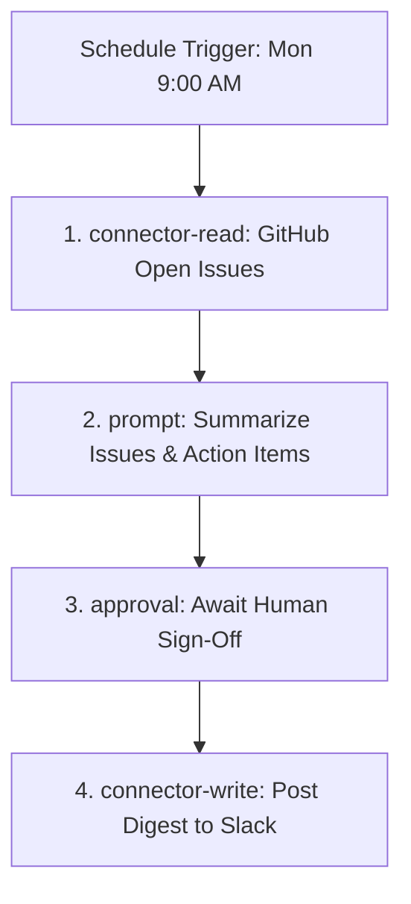

# Recurring Connector Tasks & Schedules Guide

This guide details how to create, configure, run, and manage recurring connector tasks and scheduled workflows in Fable.

---

## 1. Creating a Recurring Connector Task

A recurring connector task is a scheduled job that automatically interacts with one or more external services (such as GitHub, Vercel, Slack, or Google Calendar) on a recurring basis.

To create a recurring schedule:
1. Navigate to the **Schedules** page via the left sidebar.
2. Click **Create Schedule** (or use the `/schedule` slash command in the composer).
3. Fill in the required configuration:
   - **Name**: A descriptive name for the task (e.g., `GitHub Issue Digest`).
   - **Description**: Explanatory text for what the scheduled task achieves.
   - **Trigger**: Select `Recurring` and define:
     - **Frequency**: `Daily`, `Weekly`, or `Monthly`.
     - **Recurrence Time**: Specify the target hour and minute (in the selected timezone).
     - **Day selection**: Days of the week (for weekly) or day of the month (for monthly).
     - **Timezone**: The timezone context under which the wall-clock times are evaluated.
   - **Data Sources**: Toggle which connected connectors are granted read-only or read/write access to this execution loop.

---

## 2. Combining a Schedule with a Multi-Step Workflow

Schedules are mapped 1-to-1 to a **Workflow Definition**. By combining a schedule trigger with a multi-step workflow, you can choreograph sophisticated data pipelines:



### Example Workflow Definition Structure

```json
{
  "schemaVersion": 1,
  "id": "github-slack-digest",
  "version: 1,
  "name": "Weekly Slack Digest",
  "description": "Reads open GitHub issues and posts a summary to Slack.",
  "steps": [
    {
      "kind": "connector-read",
      "id": "fetch-issues",
      "connectorId": "github",
      "capability": "github.issues.list",
      "input": { "state": "open", "labels": ["bug"] },
      "outputVar": "raw_issues"
    },
    {
      "kind": "prompt",
      "id": "summarize-issues",
      "prompt": "Using the issues list in {{raw_issues}}, summarize the top 3 items."
    },
    {
      "kind": "approval",
      "id": "verify-digest",
      "description": "Verify the generated digest before posting it."
    },
    {
      "kind": "connector-write",
      "id": "post-digest",
      "connectorId": "slack",
      "capability": "slack.post-message",
      "input": { "channel": "#product-alerts", "text": "{{summarize-issues.output}}" },
      "target": "#product-alerts",
      "preview": "Post digest summary",
      "riskLevel": "medium"
    }
  ]
}
```

---

## 3. Assigning a Permission Profile

Every schedule trigger runs with a captured **Permission Profile**. Fable supports three standard levels:

| Profile | Mode | Permitted Effects |
| :--- | :--- | :--- |
| **Read Only** | `read-only` | Safe local reads, connector reads, and web fetch. Blocks all writes. |
| **Trusted** | `trusted-scope` | Read/write capabilities, state mutation. Blocks shell execution. |
| **Full Access** | `full-access` | Unrestricted local/external writes and powerful shell execution. |

### Re-checking Boundaries
1. **Design Time**: The UI validates that the user possesses the authority to assign a given profile.
2. **Start of Execution**: When a tick fires and leases an occurrence, the Rust queue **re-checks** the profile permissions. If the user's active profile has degraded (e.g. key revoked, workspace permissions downgraded), the run transitions immediately to `dead` with a `permission-denied` status.
3. **Task Boundaries**: Immediately before a step of type `connector-write` or `tool` executes, the runner evaluates the step-level `permissionProfile` to ensure a step cannot escalate the run's permission profile.

---

## 4. Task Lifecycle: Pausing, Resuming, Retrying, and Cancelling

```
     [Active] ──(Pause command)──> [Paused]
        │                             │
    (Tick fires)              (Tick ignores)
        │                             │
   [Leased/Queued] <──(Resume)────────┘
```

### Pausing
- Setting a schedule status to `paused` immediately cancels any active in-queue run (transitioning them to `cancelled`).
- The scheduler tick will no longer calculate or enqueue new occurrences.

### Resuming
- Setting the status back to `active` schedules the next future occurrence.
- **Missed Run Policies** evaluate any occurrences missed while the schedule was paused:
  - `skip`: (Default) Ignores all missed wall-clock occurrences; waits for the next scheduled tick.
  - `run-once`: Immediately enqueues exactly one run representing the most recent missed occurrence.
  - `run-all` (where supported): Enqueues a run for every missed occurrence sequentially.

### Retrying
- If a scheduled run fails due to transient reasons (e.g. rate-limiting, temporary network timeouts), the queue entry backoff policy retries the run.
- If it exceeds `maxAttempts` (defaulting to 3 attempts total), the queue entry transitions to `dead`.
- Users can trigger manual retries on dead/failed runs from the UI by clicking **Retry Run** and verifying the confirmation.

### Cancelling
- Users can abort active running executions by clicking **Cancel Run**.
- Fable marks the queue entry state as `cancelled` and triggers the active runner's cooperative cancellation path via an `AbortSignal`, stopping any downstream tasks from executing.

---

## 5. Inspecting Run History & Task Output

The **Run History** page lists all historical runs, showing their status, execution time, duration, and attempts.
- **Auditing**: Every task start, success, and failure is recorded in the immutable action history ledger.
- **Inspection**: Click on a run to inspect:
  - Complete transcript.
  - Task outcomes and individual step execution times.
  - Redacted outputs of connector read/write actions.

---

## 6. Example Connector-First Recurring Tasks

These example configurations demonstrate typical scheduling patterns using safe placeholders.

### Scenario A: GitHub Issue & PR Sync (Daily)
* **Goal**: Collect open PR details daily and notify developers.
* **Trigger**: Daily at 08:00 AM UTC.
* **Permission Profile**: `read-only` (safe).

```yaml
id: daily-pr-check
name: Daily PR Sync
description: Fetch open PRs and list dependencies
trigger:
  kind: recurring
  rule:
    frequency: daily
    interval: 1
    hour: 8
    minute: 0
    timezone: UTC
missedRunPolicy: skip
permissionProfile: read-only
```

### Scenario B: Database Backup & Status Alert (Weekly)
* **Goal**: Run backup script, check size, and alert on failure.
* **Trigger**: Weekly on Sundays at 02:00 AM UTC.
* **Permission Profile**: `trusted` (write access for notification channel).

```yaml
id: weekly-backup-alert
name: Weekly Backup Status
description: Runs backup validation check
trigger:
  kind: recurring
  rule:
    frequency: weekly
    interval: 1
    byWeekday: [Sun]
    hour: 2
    minute: 0
    timezone: UTC
missedRunPolicy: run-once
permissionProfile: trusted
```

---

## 7. Operational & Architectural Notes

### Timezones & DST (Daylight Saving Time)
- The recurrence engine walks instants in UTC, projecting candidate ticks against the selected IANA Timezone.
- Wall-clock minutes in DST gaps are safely skipped; repeated wall-clock minutes during DST fallbacks fire exactly once to prevent double execution.

### Retry Backoff & Jitter
- Retries use exponential backoff math: `initialBackoffMs * backoffMultiplier^(attempts - 1)`.
- Base backoff starts at 30 seconds; a lease fencing token protects each attempt to prevent stale reports.

### Idempotency Key Invariant
- Every workflow mutation and external write step generates a stable idempotency key derived from the `runId`, `stepId`, `capability`, and step `input` hash.
- This ensures that if a step is retried, the connector receiver (such as Linear or GitHub) is fenced from executing duplicate actions.

### Credential Redaction Invariant
- Fable strictly enforces secret redaction.
- Before a task outcome is persisted in the database, logged to audit trails, or surfaced to the UI, the output and inputs are recursively sanitized.
- Strings matching typical API keys (`sk-...`, `AIzaSy...`, `Bearer ...`) and JSON objects containing sensitive keys (`token`, `api_key`, `secret`, `password`) are automatically masked with `[REDACTED]`.
