# Fable core UI concept

**Date:** 18 August 2026  
**Format:** eleven large landscape desktop product shots, each generated from a 1440 x 1024 design target  
**Purpose:** a cohesive visual interpretation of the Fable product mastermap; concept work, not an implementation or readiness claim

## Product rule

Teammates first. Conversations live inside a teammate. Capability appears at the point of need. Infrastructure appears only when the person asks to inspect or control it.

## Navigation constraint

- The primary sidebar contains teammates, not conversations.
- A selected teammate owns its conversations, routines, computer, purpose and permissions.
- Projects, Knowledge and Connections are secondary workspace surfaces.
- Work, approvals and model attribution appear contextually rather than becoming permanent navigation.

## Shared visual system

- Warm paper base `#F7F5F0`, cooler navigation `#EFEEE9`, white raised surfaces.
- Graphite `#202124`, secondary ink `#74716B`, hairline rules `#DDDAD2`.
- Quiet violet `#6F66E8` only for identity, selection, focus, and active progress.
- Green only for safe/completed states; amber only for approvals.
- Geist/Inter-like humanist sans serif; readable 15px body scale.
- 8-10px radii, compact pills only for status, almost no shadow.
- No gradients, glow, glassmorphism, nested cards, charts, KPI tiles, or feature-inventory dashboards.
- One reusable shell: 248px navigation, flexible main surface, optional 300px contextual rail.
- Original folded-ribbon Fable companion family used for teammate identity.

## Product-shot inventory

1. [Teammate workspace](product-shots/01-teammate-workspace.png) — conversation inside Chief of Staff, Auto attribution, a deliverable and contextual Work rail.
2. [Onboarding](product-shots/02-onboarding-first-teammate.png) — create the first teammate through purpose and relationship rather than configuration.
3. [Teammate details](product-shots/03-teammate-details.png) — identity, purpose, permissions, computer and routines in plain language.
4. [Knowledge](product-shots/04-knowledge.png) — one everyday `What Fable knows` surface with learned preferences and provenance progressively disclosed.
5. [Connections](product-shots/05-connections.png) — capability grants explained before authorization.
6. [Routine](product-shots/06-routine-morning-brief.png) — one successful task promoted into a repeatable instruction with triggers and review policy.
7. [Computer](product-shots/07-computer.png) — execution location, active data, control permissions and teach-by-demonstration.
8. [Project deliverables](product-shots/08-project-deliverables.png) — durable work products without a dashboard or board metaphor.
9. [History](product-shots/09-history.png) — friendly restoration plus explicit GitHub and Cursor Origin interoperability.
10. [Auto and intelligence settings](product-shots/10-auto-intelligence-settings.png) — deterministic routing, honest attribution, subscriptions, APIs and account-backed runtimes.
11. [Search](product-shots/11-search.png) — one escape hatch across teammates, work, Knowledge and routines without adding permanent navigation.

## Gallery

### Teammate workspace

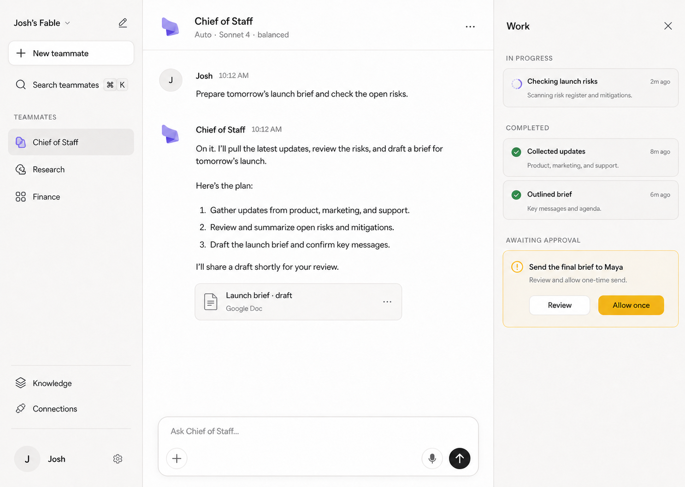

### Onboarding

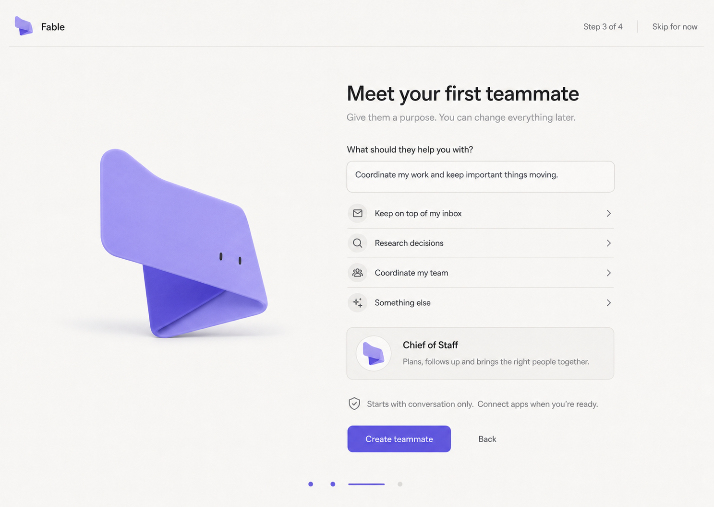

### Teammate details

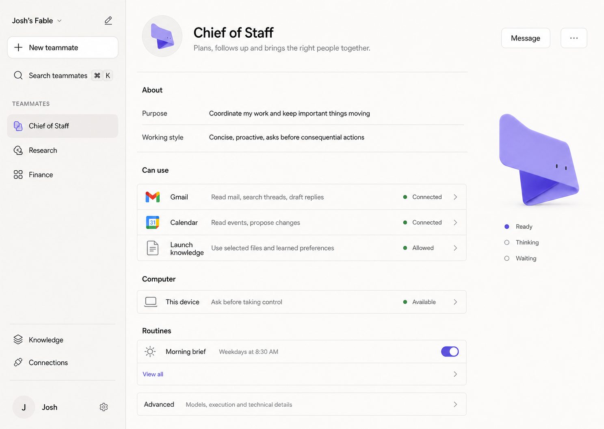

### Knowledge

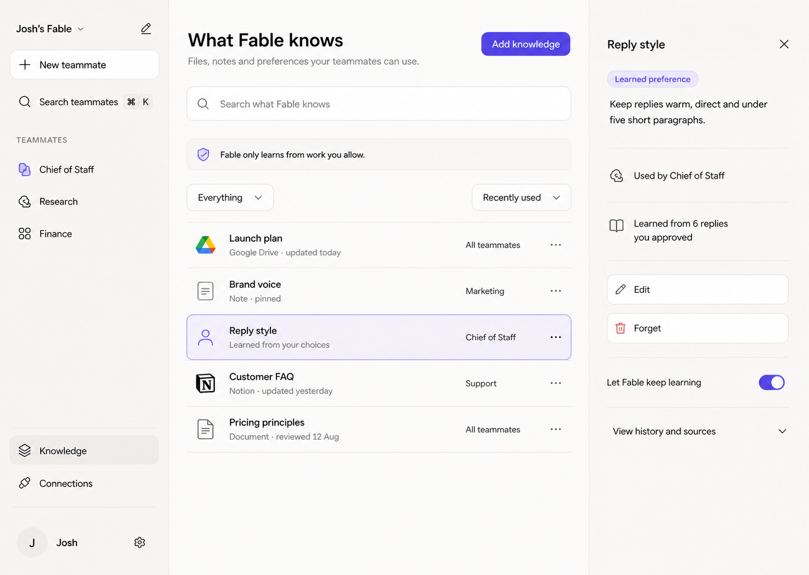

### Connections

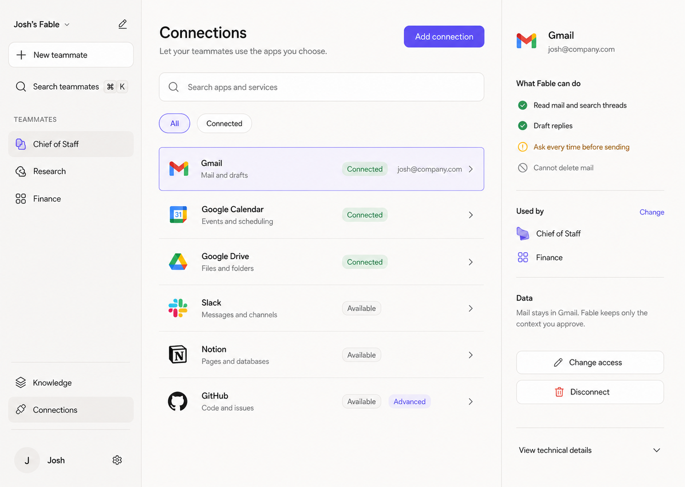

### Routine

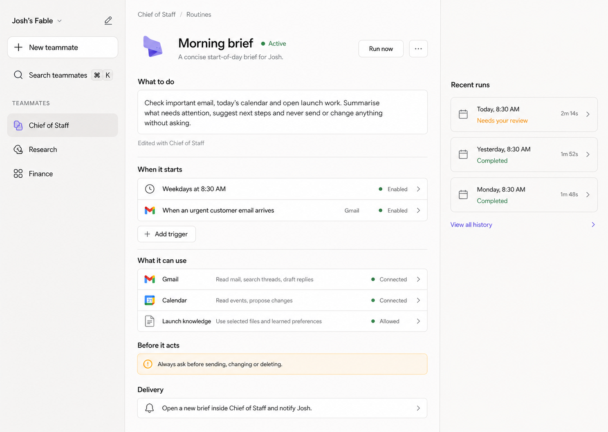

### Computer

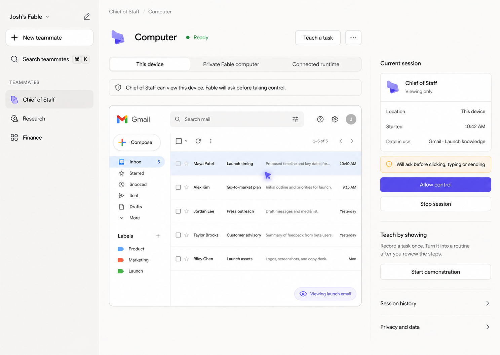

### Project deliverables

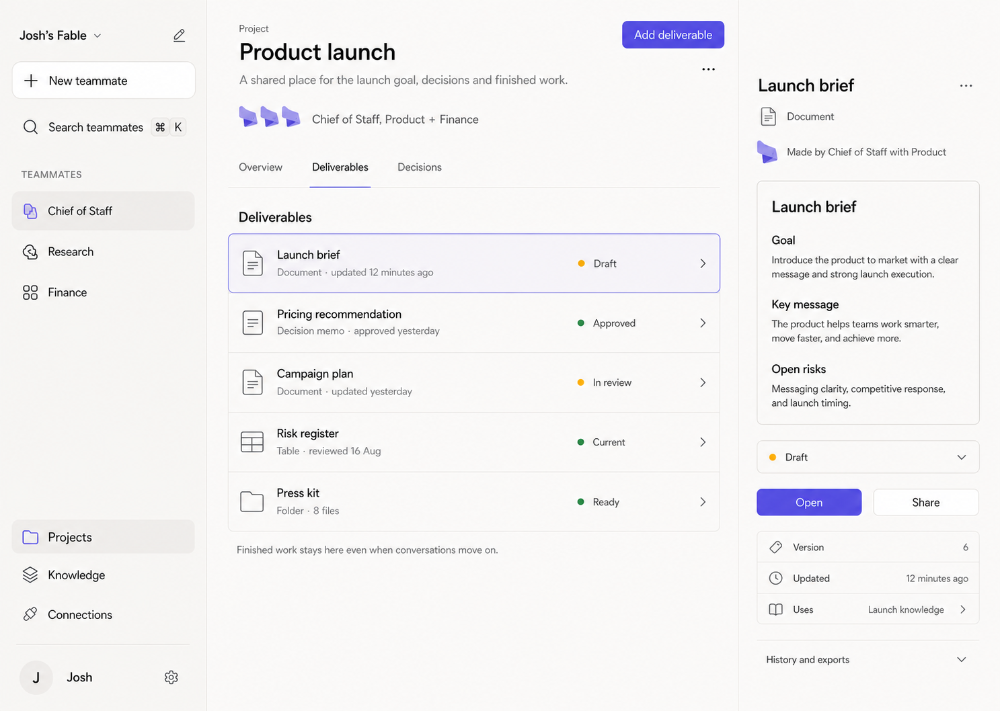

### History

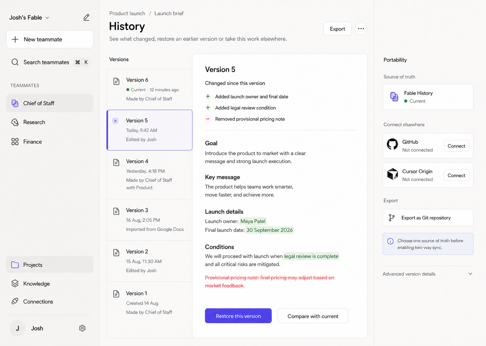

### Auto and intelligence settings

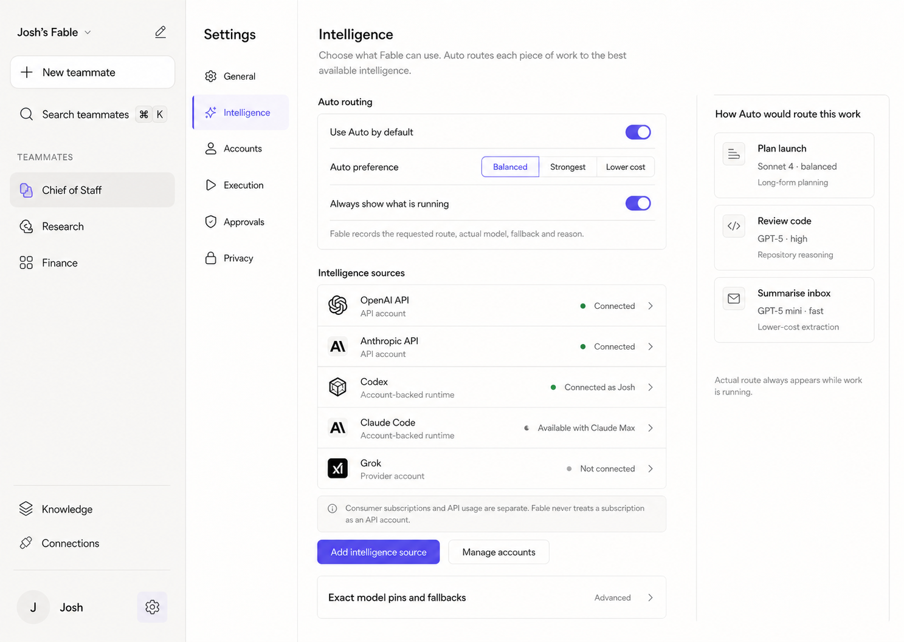

### Search

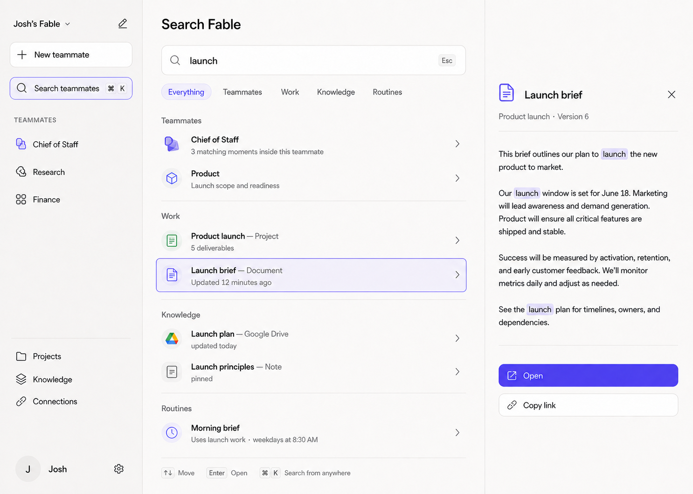

## Image-generation prompt contract

All final shots were generated independently with the built-in ImageGen tool. Every page prompt fixed the same 1440 x 1024 canvas, palette, typography, folded-ribbon identity, sidebar ontology, line weight, geometry and avoid list. Each prompt then described only that page's specific user outcome, objects, copy and progressive-disclosure behaviour. Existing Fable and Grok Bot screenshots were attached as explicitly labelled product or interaction references; Grok branding and mascots were excluded.

## Evidence boundary

These images express a future product direction. They intentionally include proposed product behaviour that is not a claim about the current implementation. Current-state truth remains governed by `docs/product/status.md`, `docs/product/release.md`, `docs/product/connectors.md`, and `docs/product/vision.md`.
