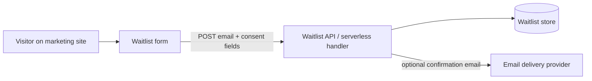

# Fable Marketing & Waitlist Legal Source Material

> **DRAFT — LEGAL REVIEW REQUIRED**

Plain-language source material for the Fable marketing site and waitlist. These files are **not** published legal notices, **not** attorney-reviewed, and **not** production-ready. They are drafting inputs for owner and legal review before any public deployment.

## Source marker (build gate)

Every file in this directory includes the marker below in its front matter. A future marketing-site build gate should **fail** if any published legal page is sourced from a file that still carries this marker, or if the marker is absent from source files that have not been explicitly promoted to a reviewed state.

```yaml
legal_status: DRAFT — LEGAL REVIEW REQUIRED
```

When legal review completes, replace `legal_status` with a reviewed value (for example `REVIEWED — PUBLISH OK`) in the promoted copy only. Do not remove version history from this directory without an explicit promotion workflow.

## Repository grounding

These drafts reflect the current Fable repository as of 2026-07-03:

| Fact | Source |
| --- | --- |
| Product name and positioning | `README.md`, `docs/brand.md`, `docs/product/vision.md` |
| Open-source, local-first, private-by-default | `README.md`, `docs/product/thesis.md` |
| Desktop app version 0.1.0; Windows preview; unsigned | `README.md`, `docs/product/release.md` |
| No hosted Fable account required for core desktop workspace | `docs/product/release.md` |
| Marketing site and legal pages planned (Milestone 5) | `docs/product/roadmap.md` |
| Optional Convex for hosted/realtime features | `docs/product/release.md` |
| Auth broker (`auth.fable.app` in tests) is separate from marketing waitlist | `apps/desktop/src-tauri/src/tests.rs`, `docs/connectors/auth-broker.md` |
| Legacy app identifier `com.arden.workspace` retained for installations | `docs/brand.md` |

## Proposed minimal waitlist data flow

The waitlist does **not** exist in the repository today. The flow below is a minimal engineering proposal that legal text should align with once owners confirm vendors and retention.



**Proposed fields collected at signup**

| Field | Required | Purpose |
| --- | --- | --- |
| `email` | Yes | Contact for waitlist and product updates |
| `consent_notice_version` | Yes | Which waitlist notice text the user saw |
| `consent_notice_accepted_at` | Yes | UTC timestamp of explicit acceptance |
| `consent_method` | Yes | e.g. `explicit_checkbox` |
| `consent_text_hash` | Yes | SHA-256 of exact notice text rendered at signup |
| `source_url` | Yes | Page URL where signup occurred |
| `locale` | No | Browser or user-selected locale |
| `referrer` / UTM params | No | Campaign attribution |

**Proposed exclusions (not collected by default)**

- Passwords, payment details, government IDs
- Desktop workspace data, API keys, connector tokens, chat history
- Sensitive analytics identifiers beyond what the cookie notice discloses

## Document index

| File | Audience | Purpose |
| --- | --- | --- |
| [`privacy-notice.md`](./privacy-notice.md) | Marketing-site visitors | What the public site collects and why |
| [`waitlist-consent-notice.md`](./waitlist-consent-notice.md) | Waitlist signups | Versioned consent copy + API recording spec |
| [`cookie-analytics-notice.md`](./cookie-analytics-notice.md) | Site visitors | Cookies, analytics, and preference controls |
| [`website-terms.md`](./website-terms.md) | Site visitors | Acceptable use and site rules |
| [`open-source-disclaimer.md`](./open-source-disclaimer.md) | Downloaders and contributors | OSS license posture and preview-product limits |
| [`data-requests.md`](./data-requests.md) | Individuals | Access, deletion, and consent withdrawal procedure |
| [`implementation-checklist.md`](./implementation-checklist.md) | Engineering and owners | Pre-publish checklist separating legal from engineering |

## Unresolved owner / legal inputs

The following placeholders appear across these drafts and **must** be resolved before publication:

| Input | Placeholder | Owner |
| --- | --- | --- |
| Data controller legal identity and postal address | `[CONTROLLER_LEGAL_NAME]`, `[CONTROLLER_ADDRESS]` | Owner / legal |
| Privacy and legal contact email | `[PRIVACY_CONTACT_EMAIL]` | Owner |
| Primary jurisdiction and governing law | `[PRIMARY_JURISDICTION]`, `[GOVERNING_LAW]` | Legal |
| Lawful basis for waitlist and marketing email | `[LAWFUL_BASIS_WAITLIST]` | Legal |
| Exact retention periods | `[RETENTION_WAITLIST]`, `[RETENTION_LOGS]` | Legal + engineering |
| Subprocessors (hosting, email, analytics) | `[SUBPROCESSOR_LIST]` | Engineering + legal |
| International data transfers | `[TRANSFER_MECHANISM]` | Legal |
| Minimum age policy | `[MINIMUM_AGE]` | Legal |
| Supervisory / complaint authority | `[COMPLAINT_AUTHORITY]` | Legal |
| Effective date of published notices | `[EFFECTIVE_DATE]` | Owner |