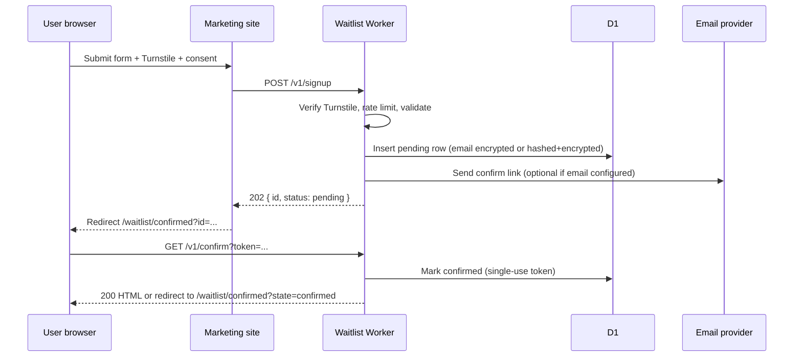
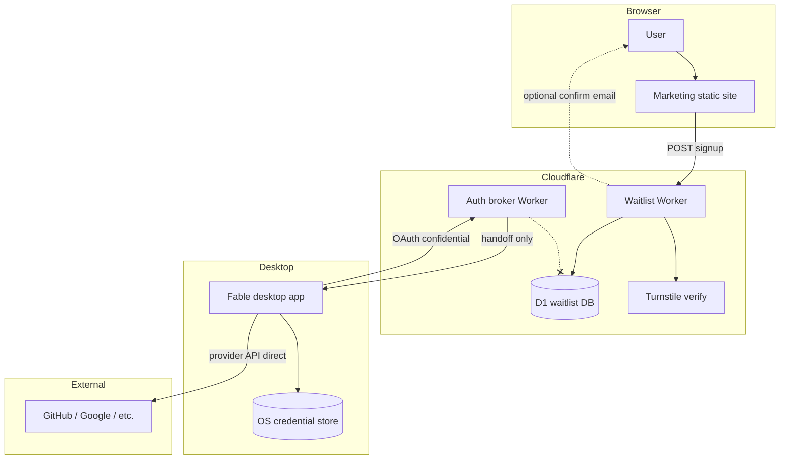

# Fable Marketing Site & Privacy-Conscious Waitlist — Implementation Specification

**Status:** Draft for implementation  
**Branch target:** `grok/overnight-waitlist-spec`  
**Last audited against product evidence:** 2026-07-03  
**Evidence sources:** `docs/product/status.md`, `docs/product/connectors.md`, `docs/product/release.md`, `docs/brand.md`, `docs/connectors/auth-broker.md`, `README.md`

This document is the implementation-grade specification for a public marketing site and a separate privacy-conscious waitlist service. It does **not** authorize implementation of the desktop app, auth broker deployment, domain registration, or external resource creation in this task.

**Related artifacts:** [Documentation index](./README.md) · [Waitlist API schema](./waitlist-api.schema.json) · [Legal drafts](./legal/) (`DRAFT — LEGAL REVIEW REQUIRED`)

---

## 1. Purpose & Non-Goals

### Purpose

- Explain what Fable is today, grounded in repo evidence.
- Collect voluntary waitlist sign-ups for a **Windows preview** with minimal personal data.
- Route interested users to the open-source repository and honest product-status documentation.
- Keep marketing data physically and logically separate from the OAuth auth broker.

### Non-Goals (this spec)

- No fabricated testimonials, user counts, certifications, pricing, ship dates, or availability guarantees.
- No claim that connectors are production-ready for external users until broker deployment and provider validation are complete.
- No hosted Fable account requirement for core local use.
- No storage of waitlist PII in `apps/broker` or any OAuth handoff path.
- No implementation, push, merge, deploy, or domain purchase in the spec-authoring task.

---

## 2. Audience

| Segment | Primary need | Site emphasis | Waitlist CTA |
| --- | --- | --- | --- |
| **Knowledge workers & operators** (non-developer primary) | Delegate repetitive work across files and tools with visible approvals | Local-first workspace, plain-language permissions, inspectable memory | "Join the Windows preview waitlist" |
| **Developers & technical leads** | Open, reviewable runtime; BYOK; connector boundaries | Open-source repo, protocol types, fail-closed connector states, CI on Windows | Same waitlist + link to GitHub |
| **Privacy-conscious early adopters** | Keep work on-device; no mandatory cloud account | Encrypted SQLite, OS credential boundary, export/delete paths | Waitlist with explicit consent copy |
| **Connector evaluators** | Understand which integrations work vs. are gated | Connector status matrix with honest labels | Optional interest field for connectors (not a commitment) |

**Anti-audience:** Users who need macOS/Linux signed releases, production OAuth connectors without operator setup, bundled local models, or a hosted-only assistant. The site must surface these gaps instead of hiding them.

---

## 3. Product Evidence Summary (Marketing May Claim)

Ground all copy in `docs/product/status.md` (audited 2026-07-05) and related docs.

| Claim | Evidence | Marketing label |
| --- | --- | --- |
| Open-source, local-first desktop workspace | `README.md`, `docs/product/vision.md` | **Implemented** |
| Tauri 2 + React desktop shell | `docs/product/status.md` §Implemented | **Implemented** |
| Core local use without hosted Fable account | `docs/product/release.md`, onboarding in status | **Implemented** |
| Windows preview builds (unsigned MSI/NSIS) | `README.md` §Windows bundles | **Preview** |
| Encrypted SQLite vault (schema v5), OS keyring credentials | status, architecture | **Implemented** (desktop) |
| BYOK native API providers (OpenAI, Anthropic, Gemini, xAI, OpenRouter) | status §Native API-key | **Implemented** (user-supplied keys) |
| ACP/Codex providers when local CLI installed | status matrix | **Functional but gated** |
| Google connectors (Drive, Gmail, Calendar) | `docs/product/connectors.md` | **Functional but gated** (user Google Cloud setup) |
| Confidential connectors (GitHub, Vercel, Notion, Slack, Linear) | connectors + auth-broker | **Functional but gated** (broker not deployed) |
| GitHub live writes | connectors §Known limitations | **Missing** (read-only) |
| GitHub Copilot execution | status matrix | **Missing** |
| Local model execution | status matrix + `docs/architecture/local-model-runtime.md` | **Functional but gated** (user-installed Ollama service and model) |
| Browser preview mode | status matrix | **Preview/fixture-only** |
| Mobile remote control | status matrix | **Local status surface; transport deferred** |
| Voice dictation | `docs/product/voice.md` | **Preview** (Web Speech API where available; unsupported in Tauri webview) |
| Auth broker (`apps/broker`) | `docs/connectors/auth-broker.md` | **Implemented foundation; not production-ready** |
| Product website / legal pages | status §Not Implemented | **Missing** (this spec defines them) |

---

## 4. Page Hierarchy & Information Architecture

```
/                          Home — positioning, honest status snapshot, primary waitlist CTA
/product                   What Fable is — local workspace pillars (no fake screenshots of unreleased UI)
/how-it-works              Composer, approvals, knowledge, schedules (evidence-backed)
/connectors                Connector matrix with required labels (§5.3)
/privacy                   Privacy philosophy + link to policy
/privacy-policy            Legal policy (owner/legal review required)
/waitlist                  Dedicated signup (duplicate of home form OK; canonical URL for campaigns)
/waitlist/confirmed        Post-submit confirmation (no PII in URL)
/open-source               Repo link, monorepo shape, contribution boundaries
/security                  Summary + link to `docs/security/threat-model.md` in repo
/download                  Windows preview instructions (build from source / artifacts when published)
/status                    Live-static snapshot from `docs/product/status.md` (manual or generated; no auto-fabrication)
/404                       Accessible not-found
```

**Navigation (header):** Product · Connectors · Open Source · Privacy · Waitlist  
**Footer:** Privacy Policy · Security · Status · GitHub · Contact (mailto or form — owner decision)

**Robots:** Allow index on public pages; `noindex` on `/waitlist/confirmed` and any admin paths.

---

## 5. Messaging

### 5.1 Positioning (from `docs/brand.md`)

- **Name:** Fable
- **Tagline:** Open AI workspace for real work.
- **One-liner:** Fable is an open-source, local-first AI workspace that lets you chat with your computer, delegate work across files and tools, and stay in control at every step.
- **Voice:** Direct, calm, serious. Avoid hype: revolutionary, magic, supercharged, copilot, agent army.

### 5.2 Primary messages (home)

1. **Your workspace stays on your machine.** Local files, memory, approvals, and schedules run in the desktop app without a Fable cloud account.
2. **Permissions are visible.** Read Only, Ask Me, Work Freely, and Custom map to explicit execution boundaries.
3. **Connectors are bridges, not black boxes.** Each integration shows auth mode, health, scopes, and fail-closed states.
4. **Windows preview today.** Unsigned Windows builds exist in-repo; macOS/Linux packaging is not ready.
5. **Open source.** Protocol and runtime boundaries are inspectable in the monorepo.

### 5.3 Connector & provider labeling (mandatory on `/connectors`)

Every row MUST use exactly one of: **Implemented**, **Functional but gated**, **Preview-only**, **Missing**.

| Integration | Label | Required footnote |
| --- | --- | --- |
| Local files | Implemented | Live in Tauri |
| Knowledge search & memory | Implemented | Encrypted SQLite; promotion is approval-gated |
| Schedules | Implemented | Requires connected runnable backend |
| BYOK API providers | Implemented | User supplies API keys to OS secure storage |
| Codex app-server | Functional but gated | Requires local Codex CLI |
| Cursor / Grok (ACP) | Functional but gated | Requires installed CLI + sign-in |
| Google Drive, Gmail, Calendar | Functional but gated | User Google Cloud OAuth client + verification |
| GitHub, Vercel, Notion, Slack, Linear | Functional but gated | Auth broker not deployed; provider console setup required |
| GitHub writes | Missing | Read-only live surface |
| GitHub Copilot | Missing | Catalog only |
| Local models | Functional but gated | Requires user-installed Ollama service and model; no bundled models/downloads |
| Browser automation | Preview-only | Fixture preview; transport deferred |
| Mobile remote | Preview-only | Status surface only; no live pairing |
| Voice dictation | Preview-only | Web Speech where host supports; not in Tauri webview |

### 5.4 Waitlist messaging

- **Headline:** Join the Fable Windows preview waitlist.
- **Subcopy:** We are preparing an unsigned Windows preview. Waitlist sign-up does not create a Fable account and does not grant early access by itself.
- **Honesty block (required near form):** "Fable's core desktop workspace runs locally without a hosted account. Waitlist data is stored separately from OAuth connector authentication."

---

## 6. Visual & Assets Plan

### 6.1 Brand tokens (`docs/brand.md`)

| Token | Value | Usage |
| --- | --- | --- |
| Graphite | `#17191A` | Text, dark surfaces |
| Surface | `#F6F2EA` | Page background |
| Copper | `#A16B3F` | Accent, links, primary CTA border |
| Strong copper | `#8A5832` | Hover/active accent |

Monochromatic UI: distinguish interactive elements with contrast, weight, and borders — not saturated interaction colors. Status colors (green/yellow/red) only for implementation-status badges.

### 6.2 Logo assets (copy or symlink at build time)

Source of truth: `apps/desktop/public/brand/`

| Asset | Use |
| --- | --- |
| `fable-logo.svg` / `fable-logo-dark.svg` | Header lockup |
| `fable-mark.svg` / `fable-mark-graphite.svg` | Favicon, compact nav |
| `fable-wordmark.svg` | Footer |
| `fable-app-icon.svg` | OG image base, download page |

**Do not** redesign the mark for marketing without brand owner approval.

### 6.3 Imagery rules

- Use **real** desktop UI captures from the current app only; label "Development build" if unsigned.
- No stock photos of people, fake customers, or illustrative "teams."
- Connector icons may reuse `apps/desktop` connector icon components exported as static SVG.
- Diagrams: mermaid or simple SVG architecture diagrams referencing actual boundaries (UI → Rust → OS store).

### 6.4 Typography & layout

- Prefer system UI stack or one licensed webfont (owner/legal: font license).
- Max content width ~72ch; generous whitespace matching calm desktop shell.
- Status badges: text label always visible (not color-only).

---

## 7. Recommended Stack (Monorepo-Compatible)

### 7.1 Marketing site — `apps/marketing`

| Layer | Recommendation | Rationale |
| --- | --- | --- |
| Framework | **Astro 5** (static output) | Fast, minimal JS, fits monorepo `pnpm --filter`, excellent no-JS baseline |
| UI | React islands only where needed (waitlist form, analytics consent) | Aligns with desktop React skills without shipping a full SPA |
| Styling | Tailwind v4 or vanilla CSS with brand tokens | Match restrained palette |
| Content | MDX for `/status` sync from `docs/product/status.md` via build script | Prevents drift |
| Package name | `@fable/marketing` | Matches `@fable/desktop`, `@fable/broker` |
| Build | `pnpm --filter @fable/marketing build` → `dist/` | Deployable to Cloudflare Pages or static host |

**Alternatives (acceptable):** Next.js static export (`output: 'export'`) if team prefers one React meta-framework — still must meet no-JS and privacy requirements below.

### 7.2 Waitlist service — `apps/waitlist` (separate Worker)

| Layer | Recommendation | Rationale |
| --- | --- | --- |
| Runtime | **Cloudflare Worker** | Same operator skill as `apps/broker`; isolated service |
| Store | **D1** (SQLite) for waitlist rows + consent audit | Queryable export/delete; not KV-only |
| Abuse | **Turnstile** siteverify | Server-side validation |
| Email | **Optional** — transactional provider (owner picks) | Confirmation only; no marketing drips without separate consent |
| Secrets | Wrangler secrets: `TURNSTILE_SECRET`, `WAITLIST_SIGNING_KEY`, optional `EMAIL_API_KEY` | Never in repo |

### 7.3 Explicit separation from auth broker

```
apps/marketing   → static site, form POST to waitlist Worker
apps/waitlist    → POST /v1/signup, GET /v1/confirm, POST /v1/delete-request, etc.
apps/broker      → OAuth only (/oauth/{provider}/...) — NO waitlist routes, NO marketing DB
```

**Invariant:** `apps/broker` MUST NOT accept, store, log, or forward waitlist fields. No shared D1 database between broker and waitlist. Cross-service correlation IDs MUST NOT join OAuth state to waitlist `subscriber_id`.

---

## 8. Waitlist Data Model

### 8.1 Fields collected at signup

| Field | Required | Storage | Notes |
| --- | --- | --- | --- |
| `email` | Yes | Normalized lowercase, trimmed | Primary contact; validated RFC5322 pragmatic subset |
| `consent_marketing` | Yes (boolean) | Stored | Must be `true` to submit — waitlist is voluntary marketing contact |
| `consent_version` | Yes | Stored | e.g. `2026-07-03` — immutable snapshot of policy version shown |
| `consent_text_hash` | Yes | SHA-256 of exact checkbox label + policy URL shown | Proves what user saw |
| `locale` | No | BCP-47 from `Accept-Language` | Max 35 chars |
| `platform_interest` | No | Enum: `windows`, `macos`, `linux`, `unspecified` | Default `windows` for current preview |
| `connector_interest` | No | JSON array of connector ids from allowlist | Informational only |
| `referral_code` | No | Opaque `[A-Za-z0-9_-]{1,32}` | Operator-issued; not UTM |
| `turnstile_token` | Request only | Never stored | Verified server-side |
| `utm_*` | **Not collected** | — | See §12 |

**Prohibited fields:** name, phone, company, password, payment, government ID, IP-as-identity (IP may be used ephemerally for rate limit; see retention).

### 8.2 Server-generated fields

| Field | Description |
| --- | --- |
| `id` | UUID v4 — public subscriber id for export/delete |
| `email_hash` | HMAC-SHA256(email, server pepper) — duplicate detection without storing duplicate plaintext |
| `status` | `pending` → `confirmed` → `unsubscribed` \| `deleted` |
| `confirm_token_hash` | Single-use confirmation token (hashed at rest) |
| `created_at`, `confirmed_at`, `updated_at` | ISO 8601 UTC |
| `source` | `web_waitlist` |
| `policy_version` | Copy of `consent_version` at confirm time |

### 8.3 Consent & versioning

- Privacy policy and waitlist checkbox label carry version `YYYY-MM-DD`.
- On submit, client sends `consent_version` + server recomputes `consent_text_hash` from a **server-side manifest** (`consent-manifest.json` in Worker) to prevent client tampering.
- If policy version changes, old signups retain historical `consent_version`; re-consent required only if operator initiates new marketing purpose (legal review).

### 8.4 Confirmation flow



- Confirmation link token: 32-byte random, URL-safe base64, expires **72 hours** (owner/legal may adjust).
- If email is not configured (dev/staging), expose **dev-only** confirm token in Worker logs — never in production UX.

### 8.5 Duplicate behavior

1. Normalize email → compute `email_hash`.
2. If row exists with `status` ∈ `{pending, confirmed}`:
   - **Do not** reveal existence (response `202 Accepted` identical to new signup).
   - Refresh `confirm_token` only if prior row is `pending` and token expired; do not send duplicate confirmation emails more than once per 24h per email_hash.
3. If row is `unsubscribed`: allow re-signup with new consent (creates new row; old row stays for audit).
4. If row is `deleted`: treat as new signup (no resurrection of deleted email without operator audit).

### 8.6 Deletion, export, unsubscribed

| Action | Endpoint | Auth | Effect |
| --- | --- | --- | --- |
| Unsubscribe | `POST /v1/unsubscribe` | Signed link in email (`unsub_token`) | `status = unsubscribed` |
| Self-service export | `POST /v1/export-request` | Email round-trip magic link | Returns JSON of subscriber's row |
| Self-service delete | `POST /v1/delete-request` | Email round-trip magic link | Soft-delete → hard-delete after 30-day legal hold (owner/legal) |
| Operator export | Admin API or D1 export | Wrangler/service token | GDPR/CCPA response bundle |
| Operator delete | Admin API | Service token | Hard delete row + consent audit |

**Export format:** JSON per `waitlist-api.schema.json` §SubscriberExport.

### 8.7 Retention

| Data class | Retention | Notes |
| --- | --- | --- |
| Confirmed waitlist row | Until unsubscribe/delete + **owner/legal hold** | See §15 |
| Pending unconfirmed row | **30 days** then hard delete | Reduces orphan PII |
| Consent audit log | **3 years** after last interaction (proposed) | Legal review required |
| Rate-limit counters | **24 hours** | Ephemeral KV or in-memory |
| Turnstile tokens | Never stored | |
| Server access logs | **30 days** max, IP truncated / not stored in D1 | Cloudflare defaults review |
| Analytics events (if consented) | **13 months** max | See §12 |

---

## 9. Abuse Controls & Turnstile

### 9.1 Rate limiting

| Scope | Limit | Response |
| --- | --- | --- |
| IP / CF-Connecting-IP | 10 signups / hour | `429` + `Retry-After` |
| email_hash | 3 attempts / day | `202` (silent) |
| Global | Worker configurable circuit breaker | `503` |

Reuse patterns from `apps/broker/src/rate-limiter.ts` conceptually; **do not share** broker rate-limit state.

### 9.2 Turnstile

- Widget on waitlist form only (not entire site).
- Server: `POST https://challenges.cloudflare.com/turnstile/v0/siteverify` with secret in Wrangler.
- Fail closed: invalid/missing token → `400` with generic message.
- **OWNER INPUT:** Cloudflare Turnstile site key/secret pair per environment.

### 9.3 Other controls

- Honeypot field `website` (hidden, must be empty).
- Block disposable-email domains list (maintained in Worker KV, optional).
- Email MX validation (DNS lookup, non-blocking warning only — do not reject on DNS failure).
- No CAPTCHA beyond Turnstile unless abuse metrics justify.

---

## 10. Analytics Consent

### 10.1 Default

- **No third-party analytics** until explicit opt-in.
- First-party, cookieless page counters (Cloudflare Web Analytics or Plausible with `consent=false` default) may run **without** cookies if owner/legal confirms they are not personal data in applicable jurisdictions.

### 10.2 Consent banner (if analytics used)

- Categories: **Necessary** (always on: consent storage, Turnstile), **Analytics** (off by default).
- Store choice in `fable_consent` cookie, 12 months, SameSite=Lax, Secure.
- Waitlist form submission does **not** imply analytics consent.

### 10.3 UTM / referral minimization

- **Do not persist** `utm_source`, `utm_medium`, `utm_campaign`, `gclid`, `fbclid`, or full referrer URL in D1.
- Optional operator-defined `referral_code` only (opaque, no PII).
- If campaign attribution is required later, use aggregated Cloudflare Analytics dashboard — not per-subscriber storage.

---

## 11. Accessibility

- WCAG **2.2 AA** target for marketing pages and waitlist form.
- Status badges: icon + text; contrast ≥ 4.5:1 on surface background.
- Form: associated `<label>`, `aria-describedby` for errors, `aria-live="polite"` for submit result.
- Focus order: skip link → main → footer; visible focus rings (copper outline).
- Turnstile: provide text alternative path — **mailto waitlist fallback** (owner decision) if widget blocks assistive tech.
- `prefers-reduced-motion`: disable decorative transitions.
- Confirmation page readable without JavaScript.

---

## 12. SEO & Social

| Item | Specification |
| --- | --- |
| `<title>` | `Fable — Open AI workspace for real work` (home); suffix pattern on inner pages |
| Meta description | ≤155 chars, no false availability |
| Canonical URLs | Absolute, HTTPS |
| `og:image` | Generated from `fable-app-icon.svg` + wordmark; 1200×630 |
| `robots.txt` | Allow `/`; disallow `/api/`, admin |
| `sitemap.xml` | Static list of public routes |
| Structured data | `SoftwareApplication` with `applicationCategory`: `DesktopApplication`, `operatingSystem`: `Windows`, **no** `offers` price |
| GitHub link | `sameAs` if repo is public |

**Forbidden SEO:** "Download now" if artifacts unpublished; star counts unless live from GitHub API; review snippets.

---

## 13. No-JavaScript Behavior

| Feature | No-JS behavior |
| --- | --- |
| Marketing pages | Fully readable (Astro static HTML) |
| Waitlist form | **Native HTML `form method="POST"`** to `https://waitlist.<domain>/v1/signup` with `accept: text/html` — Worker returns `303` redirect to confirmation page |
| Turnstile | Requires JS — provide `<noscript>` block with mailto fallback and honest message |
| Analytics consent | Default deny; no script tags |
| Connector matrix | Static HTML table |

---

## 14. Monitoring & Operational Ownership

### 14.1 Monitoring

| Signal | Tool | Alert |
| --- | --- | --- |
| Worker 5xx rate | Cloudflare Workers analytics | >1% over 15m |
| Signup latency p95 | Workers tracing | >800ms |
| Turnstile failure spike | Custom metric | >20% of signups |
| D1 error rate | CF dashboard | any sustained |
| Email bounce rate | Email provider | >5% |

### 14.2 Ownership (RACI — roles to be assigned by owner)

| Area | Responsible | Accountable |
| --- | --- | --- |
| Marketing copy accuracy | Product | Product lead |
| Privacy policy & consent text | Legal / owner | Owner |
| Waitlist Worker + D1 | Platform eng | Platform lead |
| Turnstile & CF accounts | Infra | Owner |
| Auth broker (separate) | Platform eng | Security |
| Status page freshness | Product | Product lead |
| Incident response | On-call rotation | Owner |

### 14.3 Incident types

- Waitlist data leak → rotate keys, notify per legal, pause signups.
- Broker compromise → unrelated to waitlist DB; do not mix incident comms.
- Form abuse → raise Turnstile strictness, tighten rate limits.

---

## 15. Legal / Controller / Subprocessor — Owner Input Required

> **These items MUST NOT be finalized in implementation without owner or legal sign-off.**

| # | Decision | Options / notes |
| --- | --- | --- |
| L1 | **Data controller entity** | Individual? LLC? Which jurisdiction? |
| L2 | **Lawful basis (GDPR)** | Likely consent for waitlist; document in privacy policy |
| L3 | **Subprocessors** | Cloudflare (Worker, D1, Turnstile), email provider, optional analytics |
| L4 | **DPA execution** | Cloudflare DPA; email vendor DPA |
| L5 | **Retention periods** | §8.7 proposals need confirmation |
| L6 | **Children** | Site not directed at under-16; block or disclaim |
| L7 | **US state privacy** | CPRA opt-out link if selling/sharing — likely N/A if no sell |
| L8 | **Email content** | Confirmation vs. promotional; CAN-SPAM/GDPR unsubscribe |
| L9 | **International transfers** | SCCs for EU → US Cloudflare |
| L10 | **Privacy policy URL** | Host path `/privacy-policy` — counsel draft |
| L11 | **Contact for data requests** | `privacy@` address — owner provision |
| L12 | **Hard-delete vs soft-delete timing** | 30-day hold proposed in §8.6 |

---

## 16. Data-Flow Diagram



**Legend:** `B -.-x D1` = intentional absence of data path.

---

## 17. Threat Model (Waitlist)

| Threat | Mitigation |
| --- | --- |
| Email harvesting via enumeration | Uniform `202` responses; rate limits |
| Bot signups | Turnstile + honeypot + rate limit |
| Token replay on confirm | Single-use hash, expiry |
| SQL injection | D1 parameterized queries only |
| XSS on marketing site | Astro escape; CSP `default-src 'self'` |
| Broker ↔ waitlist data merge | Separate services, no shared IDs |
| Operator insider export | Admin API behind CF Access + audit log |
| GDPR erasure failure | Delete playbook + D1 backup purge process (owner) |

---

## 18. API Contract

Normative machine-readable schema: [`waitlist-api.schema.json`](./waitlist-api.schema.json).

### 18.1 Endpoints summary

| Method | Path | Auth | Description |
| --- | --- | --- | --- |
| `POST` | `/v1/signup` | Turnstile | Create pending subscriber |
| `GET` | `/v1/confirm` | Query token | Confirm email |
| `POST` | `/v1/unsubscribe` | Bearer unsub token | Unsubscribe |
| `POST` | `/v1/export-request` | — | Start export magic link |
| `GET` | `/v1/export` | Export token | Download JSON |
| `POST` | `/v1/delete-request` | — | Start delete magic link |
| `POST` | `/v1/delete` | Delete token | Execute delete |
| `GET` | `/v1/health` | — | `200 ok` |

All error bodies: `{ "error": { "code": "...", "message": "..." } }` — no stack traces.

### 18.2 CORS

- Allow origin: marketing site production + preview origins only.
- `POST` from static marketing domain; credentials false.

---

## 19. Deployment Environments

| Env | Marketing | Waitlist Worker | D1 | Turnstile | Email |
| --- | --- | --- | --- | --- | --- |
| **local** | `pnpm --filter @fable/marketing dev` | `wrangler dev` | local D1 | test keys | console/log |
| **preview** | CF Pages preview per PR | `waitlist-preview` worker | preview DB | test keys | disabled or mailtrap |
| **staging** | `staging.<domain>` | `waitlist-staging` | staging D1 | staging widget | mailtrap |
| **production** | apex + `www` | `waitlist` | prod D1 | prod widget | production provider |

**Auth broker:** deploy only when enabling confidential connectors — **separate** release train from waitlist.

Environment variables (waitlist Worker):

```
TURNSTILE_SECRET
WAITLIST_EMAIL_PEPPER
WAITLIST_SIGNING_KEY
CONFIRM_URL_BASE=https://waitlist.<domain>
MARKETING_ORIGIN=https://<domain>
EMAIL_API_KEY (optional)
```

---

## 20. Acceptance Tests

Implement as Vitest + `wrangler` test pool + Playwright for marketing site.

### 20.1 Waitlist Worker (API)

| ID | Test |
| --- | --- |
| W-01 | Valid signup returns `202` and creates `pending` row |
| W-02 | Duplicate email returns identical `202` without leaking |
| W-03 | Invalid Turnstile returns `400` |
| W-04 | Rate limit returns `429` |
| W-05 | Confirm with valid token sets `confirmed` |
| W-06 | Confirm token single-use — second use fails |
| W-07 | Expired confirm token fails |
| W-08 | Unsubscribe sets `unsubscribed` |
| W-09 | Delete flow removes row after confirm |
| W-10 | Export returns only caller's data |
| W-11 | Honeypot filled returns `202` no-op |
| W-12 | `consent_version` mismatch with manifest rejected |
| W-13 | Broker Worker has no `/v1/signup` route (contract test) |

### 20.2 Marketing site (E2E)

| ID | Test |
| --- | --- |
| M-01 | Home renders tagline and honest Windows preview label |
| M-02 | `/connectors` rows use only allowed status labels |
| M-03 | Waitlist form submits with JS disabled (HTML POST) |
| M-04 | Confirmation page shows no email in URL |
| M-05 | noscript mailto fallback present |
| M-06 | Privacy policy linked from form checkbox |
| M-07 | Lighthouse a11y ≥ 90 on home |
| M-08 | No third-party cookies before analytics consent |
| M-09 | `og:image` resolves |
| M-10 | Forbidden claims scanner CI fails on banned phrases (§21) |

### 20.3 Security

| ID | Test |
| --- | --- |
| S-01 | CSP headers on marketing |
| S-02 | Waitlist responses never include full email in HTML |
| S-03 | Admin routes behind CF Access |

---

## 21. Launch Checklist

- [ ] Owner/legal sign-off on §15 items
- [ ] Privacy policy published at `/privacy-policy`
- [ ] Consent manifest version bumped and matches checkbox copy
- [ ] Turnstile production keys configured
- [ ] D1 migrations applied; backup policy documented
- [ ] Email confirmation tested end-to-end
- [ ] Duplicate signup behavior verified
- [ ] Export/delete magic links tested
- [ ] Marketing copy reviewed against §21 forbidden claims
- [ ] `/status` matches `docs/product/status.md`
- [ ] Connector matrix labels verified
- [ ] Windows download instructions accurate (unsigned disclaimer)
- [ ] `robots.txt` + `sitemap.xml` deployed
- [ ] Monitoring alerts configured
- [ ] Incident runbook linked in internal ops doc
- [ ] Auth broker **not** required for waitlist launch
- [ ] Preview/staging smoke tests green
- [ ] Accessibility audit (keyboard + screen reader spot check)

---

## 22. Forbidden Claims

Marketing CI SHOULD fail if any page contains these patterns (case-insensitive):

| Forbidden | Why |
| --- | --- |
| "SOC 2" / "ISO 27001" / "HIPAA compliant" | No certifications in evidence |
| "Thousands of users" / "Join 10,000+" | No user counts |
| "Available now on Mac" / "Linux download" | macOS/Linux packaging missing |
| "Works with all your tools out of the box" | Connectors gated |
| "No setup required" (re: connectors) | Google Cloud + broker setup required |
| "Encrypted end-to-end cloud sync" | No hosted sync product |
| "HIPAA-ready" / "enterprise-ready" | Unsubstantiated |
| Named customer logos or quotes | No testimonials |
| Specific price / "Free forever" / subscription price | No pricing product |
| Ship dates ("July 2026 public launch") | No committed dates |
| "GitHub writes" / "post to GitHub automatically" | Read-only |
| "Local AI models included" | Fable does not bundle models; Ollama is user-installed/gated |
| "Fable account" required for core use | False |
| "Fully HIPAA" / "bank-grade" | Hype |
| "Copilot replacement" | Brand voice avoids copilot positioning |

**Allowed with label:** "Windows preview (unsigned)", "open source", "local-first", "functional but gated" with footnote.

---

## 23. Monorepo Integration Plan

### 23.1 New packages (future implementation)

```
apps/marketing/          # Astro site
apps/waitlist/           # CF Worker + D1 migrations
docs/marketing/          # This spec (documentation only)
```

### 23.2 Root `package.json` scripts (proposed)

```json
{
  "marketing:dev": "pnpm --filter @fable/marketing dev",
  "marketing:build": "pnpm --filter @fable/marketing build",
  "waitlist:dev": "pnpm --filter @fable/waitlist dev",
  "waitlist:deploy": "pnpm --filter @fable/waitlist deploy",
  "marketing:check-forbidden-claims": "node apps/marketing/scripts/check-claims.mjs"
}
```

### 23.3 CI (future)

- `marketing:build` on PR
- `waitlist` vitest + D1 migrate dry-run
- Playwright smoke against built `dist/`
- Forbidden-claims scan

---

## 24. Open Questions (Product, Not Legal)

| # | Question | Default if unanswered |
| --- | --- | --- |
| Q1 | Public GitHub repo URL for `/open-source` | Omit button until public |
| Q2 | Mailto fallback address for noscript | `hello@` placeholder — owner fills |
| Q3 | Email confirmation provider | Transactional only when owner configures |
| Q4 | Generate `/status` from status.md in CI | Manual sync each release |

---

## 25. Document History

| Version | Date | Change |
| --- | --- | --- |
| 1.0 | 2026-07-03 | Initial implementation-grade spec from product evidence audit |
