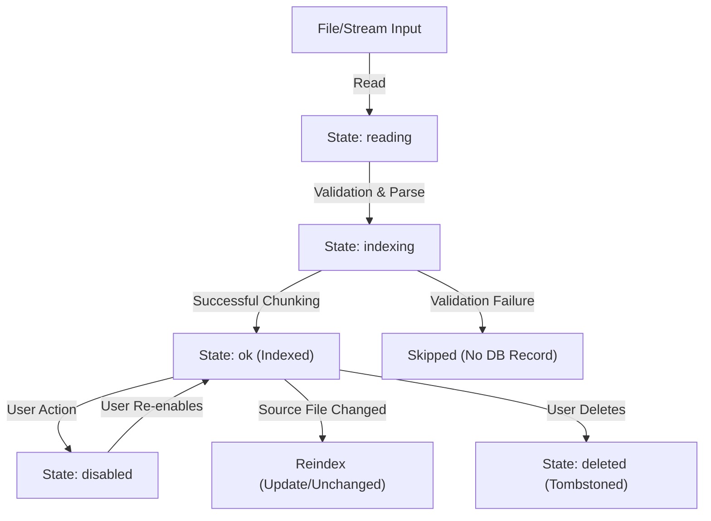

# Knowledge & Memory Lifecycle Reference

This document defines the lifecycle states, scopes, boundaries, and validation invariants governing Fable's local-first Knowledge and Memory systems. It details how content transitions from raw files or connector streams into indexed sources, durable memories, and agent context.

---

## 1. Record Ownership and Scoping Boundaries

All user-owned knowledge and memory records are strictly compartmentalized across five boundary levels:

*   **Workspace Boundary**: The absolute partition of user data. Workspaces are top-level silos. Production Tauri databases use composite primary keys `(workspace_id, id)` on the `knowledge_source`, `memory_record`, `knowledge_chunk`, `pinned_context`, and tombstone tables. Active operations enforce SQL query predicates filtering on `workspace_id` to prevent cross-workspace leakage.
*   **Project Boundary**: A project belongs to a single workspace. Records can carry an optional `project_id`. Workspace-level queries exclude project-scoped records; callers must explicitly specify the project context.
*   **Thread Boundary**: Message histories and active agent runs belong strictly to a project and thread. Pinned context can be scoped to the thread level to constrain retrieval.
*   **Connector Boundary**: Connector configuration (`connector_account`) is workspace-scoped. Derived knowledge sources retain their `connector_id` and are valid only while the connector remains connected and authorized.
*   **Account Boundary**: Provenance metadata includes the source connector account (e.g., account email or ID) to distinguish sources imported from different accounts on the same provider.

---

## 2. Safe Provenance Metadata Fields

To ensure security and traceability, knowledge sources and citations carry verified, secret-free metadata:

*   `provenance`: A user-facing origin string (e.g., `"Local file - 1.2 KB"` or `"Connector: github"`).
*   `freshness`: A relative timestamp string (e.g., `"just now"`, `"10 min ago"`, `"2 h ago"`, or `"3 d ago"`) computed dynamically from content modifications (`modifiedAt`) or ingestion time (`fetchedAt`).
*   `account`: The email or username representing the source account.
*   `sourcePath`: The sanitized, boundary-relative path (e.g., `docs/architecture.md`) of the file within its import root, preserving directory structure.
*   `mediaType`: The verified media/MIME type (e.g., `text/markdown`, `application/json`, `text/csv`, `application/yaml`).
*   `scope`: The bounding `KnowledgeScope` (global, project, or thread).

---

## 3. Source Lifecycle Transitions

### Ingestion States
The UI state hook tracks imports through three stages:
1.  **Reading**: Reading content bytes from the local disk or connector stream.
2.  **Indexing**: Running classifiers, parsing structure, and extracting chunks.
3.  **Indexed (`ok`)**: Chunks and metadata persisted into the SQLite database.

### Failure Handling
Ingestion is bounded and fails closed. If a candidate file fails validation (e.g., is oversized, empty, binary, contains path-escape segments, or has malformed JSON/CSV/YAML), the ingestion outcomes skip the record with a specific reason. The database remains unchanged, and no phantom source row or stale optimistic state is left in memory.

### Deduplication and Re-indexing
*   **Deduplication**: Ingestion uses the SHA-256 fingerprint of the normalized text to compute a stable source ID: `source-${connectorId}-${slug(hash).slice(0,12)}`. If a file is re-imported or synced with identical content (even under a different path or filename), it is recognized as `unchanged`. Its provenance path and title are refreshed in-place (`repathSource`), but chunk indexes are preserved.
*   **Updates**: If a candidate matches an existing source's filename/path but has different content, it is ingested as an `updated` outcome. The existing stable ID and user-configured states (such as pins) are preserved, but the chunks and content fingerprint are updated.

---

## 4. Memory Lifecycle Transitions

*   **Promotion**: Fact memory records are created through explicit user confirmation or promoted from knowledge sources via an approval-gated prompt. Only live, authorized sources can be promoted to memory.
*   **Editing**: Users can edit the text and metadata of a memory record directly.
*   **Pinning**: Memory records can be pinned to specific scopes. Pinned memories are always included in context assembly.

---

## 5. Terminology and Exclusion Semantics: Disable vs. Delete vs. Forget

| Action | Terminology | Database State | Retrieval & Context Assembly | Export Behavior | Management View |
| :--- | :--- | :--- | :--- | :--- | :--- |
| **Disable** | **Disabled** | Retained in DB. Flag `disabled = 1` set. | Excluded. Pinned references are automatically dropped. | Excluded from plaintext export. | Remains visible for review and re-enabling. |
| **Delete (Source)**| **Deleted** | Removed from DB. Entry added to `knowledge_tombstone`. | Excluded. Chunks and pins are dropped via CASCADE constraints. | Excluded. | Hidden (removed completely). |
| **Forget (Memory)**| **Forgotten**| Flagged `forgotten_at` timestamp. Entry added to `memory_tombstone`. | Excluded. Pinned references are automatically dropped. | Excluded. | Hidden from standard management views; audit tombstone prevents resurrection. |

### Deletion and Forget Guards (Tombstones)
To prevent background syncs, folder re-imports, or routine writes from resurrecting content a user explicitly chose to remove:
*   A deleted source writes its ID and a timestamp into the `knowledge_tombstone` table.
*   A forgotten memory writes its ID and a timestamp into the `memory_tombstone` table.
*   Upsert queries check these tables and reject writes matching a tombstone ID.

---

## 6. Retrieval Exclusion Rules

The retrieval pipeline (`packages/knowledge/src/retrieval/retrieve.ts`) filters out records before scoring. An item cannot enter retrieval or context if it meets any of these criteria:

1.  **Disabled**: `source.disabled === true` or `memory.disabled === true`.
2.  **Forgotten**: `memory.forgottenAt` is not null.
3.  **Excluded Statuses**: Source status is `"error"`, `"stale"`, or `"indexing"`.
4.  **Connector Authorization**: The source belongs to a disconnected or unauthorized connector.
5.  **Scope Mismatch**: The record scope does not satisfy the active scope filter (e.g., thread-scoped queries cannot read project-scoped records from a different project).

---

## 7. Citation Resolution

Citations identify the exact source and segment used.
*   **Coordinate mapping**: Chunks store stable offsets (`charStart`/`charEnd`) and a stable identifier (`${sourceId}#${ordinal}`) that link back to the exact location in the original text.
*   **Structure-aware chunking**: Chunk limits (default 1200 characters) split content on logical boundaries:
    *   *Markdown*: Splits on ATX headings.
    *   *JSON*: Splits on top-level array elements or object key-value entries.
    *   *CSV*: Groups rows (target 50 rows), prepending the header row to every chunk to preserve tabular context.
    *   *YAML*: Splits on document separators and top-level mapping keys.

---

## 8. Export Contract

The export action format is plaintext and strictly **secret-free**:
*   **Plaintext Format**: Plaintext JSON or Markdown files.
*   **Live-Only**: Excludes disabled sources and forgotten/disabled memories.
*   **Secret-Free**: Rejects and redacts credentials, OAuth tokens, API keys, keyring identifiers (`credential_ref`), and raw audit payloads.
*   **Bounded Previews**: Source text content is capped to a readable preview (typically 6,000 characters) to avoid dumping full database payloads.

---

## 9. Connector Boundary Interactions

*   **OAuth Disconnection/Revocation**: Disconnecting a connector account or revoking credentials instantly invalidates all derived sources.
*   **Gated Actions**: Un-authorized sources are excluded from retrieval, cannot be pinned, and cannot be promoted to memory. Re-authorizing the connector restores access to the sources without duplicating records.

---

## 10. Migration and Backward Compatibility

*   **Schema version v5 Migration**: The v5 migration converts `knowledge_source` and `memory_record` to use composite primary keys `(workspace_id, id)`. It creates `knowledge_chunk`, `pinned_context`, and tombstone tables.
*   **Preservation of Legacy Data**: Migration is transaction-safe. Existing records are mapped to the `default` workspace, and legacy payloads are decrypted and re-sealed using workspace-bound AAD.
*   **JSON file migration**: A 6-phase idempotent pipeline reads legacy JSON configs, logs parse errors, upserts records inside a database transaction, and rolls back on failure. Legacy JSON files are never deleted on disk.

---

## 11. Browser-Preview vs. Tauri Production Path

*   **Browser Preview Mode**: Synthetic, fixture-backed runtime. Credentials, connector search, and import use simulated responses. States are persisted via `localStorage` instead of SQLite.
*   **Production Tauri Path**: Persists data inside `fable-vault.db` (encrypted using AES-256-GCM via a keyring-stored master key). Secrets are isolated in the platform secure store and never enter the database.
