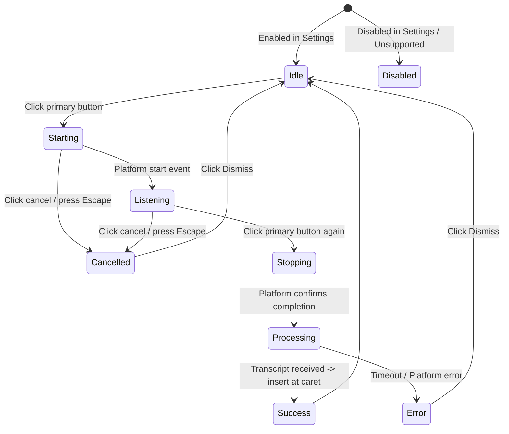

# Voice Dictation Support

This document details the system design, user controls, privacy parameters, and developer testing guidelines for voice dictation in Fable.

---

## 1. Platform Compatibility & Availability

Voice dictation in Fable relies on the host browser or desktop webview's speech-recognition API. Fable detects capability and availability dynamically; the operating system or browser may process speech through a remote service.

| Platform / Runtime | Support Level | Implementation Detail |
| :--- | :--- | :--- |
| **Compatible web browser** | Runtime-dependent | Integrates when the runtime exposes `window.SpeechRecognition` or `window.webkitSpeechRecognition`. |
| **Desktop Shell (Tauri)** | Unsupported (Fallback) | Lacks a built-in SpeechRecognition runtime. The interface falls back gracefully to a disabled indicator, prompting text input. |

### Capability Check
Fable evaluates compatibility on startup by checking if the browser defines speech recognition APIs without initiating any session or requesting microphone permission.

---

## 2. UX Controls & Lifecycle

Dictation controls are integrated inline inside the universal composer to preserve context and draft safety.

*   **Primary Action**: A single button toggles state. In `idle` state, clicking starts dictation. In `listening` state, clicking stops recording.
*   **Cancel Action**: A secondary `X` button appears during dictation (`starting`, `listening`, or `stopping`). Clicking it or pressing `Escape` cancels recording immediately, discarding audio without updating the draft.
*   **Feedback & Status**: A polite live-announcement region displays the current state (e.g., `"Starting dictation"`, `"Listening"`, `"Processing dictation"`, or error details).
*   **Privacy Gating**: Users can enable/disable voice dictation under **Settings > Privacy**. When toggled off, the button is disabled and keyboard focus passes past it.

---

## 3. Privacy & Security Boundaries

Fable is built on local-first principles. Voice dictation strictly adheres to the following privacy parameters:

*   **Fable Non-Retention**: Fable does not retain raw audio or persist a separate dictation transcript. The operating system or browser may send speech to a remote service under its own policies. Recognized text is inserted into the normal composer draft and follows the same persistence behavior as text the user types.
*   **Explicit Consent**: Fable never starts the microphone on mount or in the background. Recording is triggered *only* by an explicit, deliberate user click.
*   **Platform Fallback**: If the host environment does not support speech recognition, the system fails closed safely and falls back to standard text entry.

---

## 4. Developer Notes & Testing Guidelines

Dictation is built from three main components:
1.  **Connector Boundary** (`packages/connectors/src/voice/stt-boundary.ts`): Wraps the browser's speech recognition lifecycle. Implements auto-timeout thresholds (8 seconds for startup, 5 seconds for stopping) to prevent lockups.
2.  **State Hook** (`apps/desktop/src/hooks/useVoice.ts`): Manages React state machine transitions, operations fencing, and settings gating.
3.  **Composer Component** (`apps/desktop/src/components/Composer.tsx`): Exposes accessibility roles, keyboard events, and tooltip messages.

### Testing Conventions
*   **Boundary Tests** (`packages/connectors/src/voice/stt-boundary.test.ts`): Verify timeout conditions, content-free platform error mapping, result finality, and cleanup.
*   **Hook Tests** (`apps/desktop/src/hooks/useVoice.test.tsx`): Verify state changes, duplicate startup protection, unmount cleanup, and settings toggling.
*   **UI Tests** (`apps/desktop/src/components/Composer.voice.test.tsx`): Assert ARIA attributes, live regions, tab indexing, and Escape key cancel functionality.

---

## 5. Evidence Checked

*   **Speech-to-Text boundary wrapper**: [`packages/connectors/src/voice/stt-boundary.ts`](../../packages/connectors/src/voice/stt-boundary.ts)
*   **Orchestration hook**: [`apps/desktop/src/hooks/useVoice.ts`](../../apps/desktop/src/hooks/useVoice.ts)
*   **Inline Composer interface**: [`apps/desktop/src/components/Composer.tsx`](../../apps/desktop/src/components/Composer.tsx)
*   **Composer testing suite**: [`apps/desktop/src/components/Composer.voice.test.tsx`](../../apps/desktop/src/components/Composer.voice.test.tsx)
*   **App integration tests**: [`apps/desktop/src/App.test.tsx`](../../apps/desktop/src/App.test.tsx)
